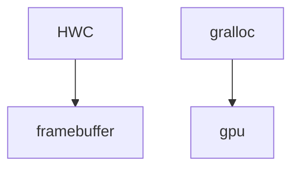
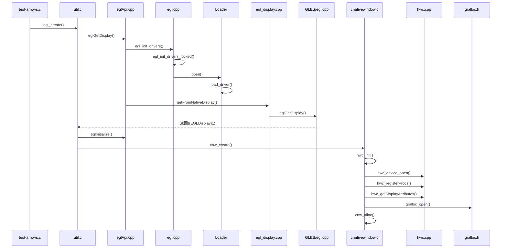

# 					EGL

​		以系统中hardware/libhardware/tests/hwc/目录中的测试程序为入口，学习opengl、egl、gralloc和framebuffer的调用关系。

​	这个测试程序的主函数很简单：

```c
    int main(int argc, char **argv) {
      EGLDisplay display;
      EGLSurface surface;
      int w, h, count = 0;
      if (argc > 1)
        count = atoi(argv[1]);
1）   if (egl_create(&display, &surface, &w, &h))
        return -1;
      if (prepare(w, h))
        return -1;
      for (;;) {
        render();
        eglSwapBuffers(display, surface);
        if (count > 0)
          if (--count == 0)
            break;
      }
      egl_destroy(display, surface);
      return 0;
    }
```

​		循环count次，做绘制工作。

1）egl_create

​		egl_create定义在测试程序里util.c中，是一个初始化过程：

```c
    int egl_create(EGLDisplay *_display, EGLSurface *_surface, int *_w, int *_h) {
      EGLBoolean res;
      EGLConfig config = { 0 };
      EGLint context_attrs[] = { EGL_CONTEXT_CLIENT_VERSION, 2, EGL_NONE };
      EGLint config_attrs[] = {
        EGL_SURFACE_TYPE, EGL_WINDOW_BIT,
        EGL_RENDERABLE_TYPE, EGL_OPENGL_ES2_BIT,
        EGL_NONE };
      EGLint major, minor;
      EGLContext context;
      EGLSurface surface;
      EGLint w, h;
      EGLDisplay display;
      EGLNativeWindowType window;
      unsigned width, height, format;
      struct CNativeWindow *cnw;

1.1） display = eglGetDisplay(EGL_DEFAULT_DISPLAY);
      if (display == EGL_NO_DISPLAY)
        return -1;

1.2)  if (!(res = eglInitialize(display, &major, &minor)))
        return -1;

      fprintf(stderr, "egl version: %d.%d\n", major, minor);

1.3）  if ((cnw = cnw_create()) == 0)
        return -1;

      cnw_info(cnw, &width, &height, &format);
      window = (EGLNativeWindowType) cnw;

      if ((res = select_config_for_window(display, config_attrs, format, &config)))
        goto fail;

      surface = eglCreateWindowSurface(display, config, window, NULL);
      if (surface == EGL_NO_SURFACE)
        goto fail;

      context = eglCreateContext(display, config, EGL_NO_CONTEXT, context_attrs);
      if (context == EGL_NO_CONTEXT)
        goto fail;

      if (!(res = eglMakeCurrent(display, surface, surface, context)))
        goto fail;

      eglQuerySurface(display, surface, EGL_WIDTH, &w);
      eglQuerySurface(display, surface, EGL_HEIGHT, &h);

      fprintf(stderr, "window: %d x %d\n", w, h);

      *_display = display;
      *_surface = surface;
      *_w = w;
      *_h = h;

      _cnw = cnw;
      return 0;

    fail:
      cnw_destroy(cnw);
      return -1;
    }
```

​	1.1）EGLDisplay和EGLSurface 都是void *类型的指针。egl_create进一步调用libEGL.so中的eglGetDisplay（）函数，代码在frameworks/natvie/opengl/libs/EGL中。eglGetDisplay（）函数通过egl_init_drivers_locked（）来完成实现库的加载：

```c
static EGLBoolean egl_init_drivers_locked() {
    if (sEarlyInitState) {
        // initialized by static ctor. should be set here.
        return EGL_FALSE;
    }
    // get our driver loader
    Loader& loader(Loader::getInstance());
    // dynamically load our EGL implementation
    egl_connection_t* cnx = &gEGLImpl;
    if (cnx->dso == 0) {
        cnx->hooks[egl_connection_t::GLESv1_INDEX] =
                &gHooks[egl_connection_t::GLESv1_INDEX];
        cnx->hooks[egl_connection_t::GLESv2_INDEX] =
                &gHooks[egl_connection_t::GLESv2_INDEX];
        cnx->dso = loader.open(cnx);
    }
    return cnx->dso ? EGL_TRUE : EGL_FALSE;
}
```

​	gEGLImpl是一个struct egl_connection_t的变量，这个变量的声明如下：

````c
struct egl_connection_t {
      enum {
        GLESv1_INDEX = 0,
        GLESv2_INDEX = 1
    };

    inline egl_connection_t() : dso(0) { }
    void *              dso;
    gl_hooks_t *        hooks[2];
    EGLint              major;
    EGLint              minor;
    egl_t               egl;

    void*               libEgl;
    void*               libGles1;
    void*               libGles2;
};
-----------------------------------------------
struct gl_hooks_t {
    struct gl_t {
        #include "entries.in"
    } gl;
    struct gl_ext_t {
        __eglMustCastToProperFunctionPointerType extensions[MAX_NUMBER_OF_GL_EXTENSIONS];
    } ext;
};
-----------------------------------------------
struct egl_t {
    #include "EGL/egl_entries.in"
};
````

​		其中的gl_hooks_t包含的entries.in文件里定义了gl类型的接口函数，函数名以\*gl\* 开头。egl_t包含的EGL/egl_entries.in文件里定义了egl类型的接口函数，函数名以\*egl\* 开头。

​	egl_init_drivers_locked函数通过打开对应的driver，初始化gEGLImpl变量，这个过程通过loader.open函数实现。这个函数进一步调用Loader::load_driver（），首先查找/vendor/lib/egl和/system/lib/egl目录（64位系统则查找/vendor/lib64/egl和/system/lib64/egl）下是否有符合libGLES\*.so命名的库文件，若没有则在相同路径下查找libEGL*.so命名的库文件及libGLESv1_CM\*.so和libGLESv2\*.so。这说明有egl实现库有两种加载方案：1.加载libGLES\*.so；2.加载libEGL\*.so+libGLESv1_CM\*.so+libGLESv2\*.so；但是无论哪种方案，库文件都是厂商封装好的，没有源码可以看，只能转向Android模拟器使用的libGLES_android.so。

​	Loader::load_driver（）通过dlopen加载库文件后，再通过dlsym找到EGL/egl_entries.in文件中声明的函数在libGLES_android.so的实现，将对应的函数指针赋值给gEGLImpl。libGLES_android.so中还应提供eglGetProcAddress（）函数的实现，用于在dlsym加载函数指针失败的情况下，库函数直接返回对应的函数指针。同时将gEGLImpl中的gl_hooks_t hooks数组中通过entries.in声明的函数指针初始化为libGLES_android.so中的实现。最后初始化gEGLImpl的libEgl、libGles2、libGles1指针分别为/system/lib/（64位系统是/system/lib64/）下的libEGL.so、libGLESv2.so和libGLESv1_CM.so库的dlopen指针。

​	framework/native/opengl下编译生成的libEGL.so、libGLESv2.so和libGLESv1_CM.so库只是真正的EGL和OpenGL实现的包装库，相当于在基于EGL和OpenGL标准下提供了一个统一的框架，厂商在这个框架下实现对应的函数。

​	同时eglGetDisplay调用实现库中的eglGetDisplay函数，传入的参数是native系统的窗口显示ID值，在模拟器中得到的返回值为((EGLDisplay)1)。同时初始化两个对象：1.初始化实现库中gDisplays数组里对应的egl_display_t对象的type为我们传入的EGL_DEFAULT_DISPLAY；2.初始化sDisplay数组中对应的egl_display_t对象的dpy变量为从实现库中获得的返回值((EGLDisplay)1)。这样libEGL中的sDisplay数组和实现库中的gDisplays数组就对应上了。

​	1.2）做一些初始化的工作，包括egl_cache等结构体

​	1.3）cnw_create（）又回到了测试程序进程，生成一个struct CNativeWindow类型的变量win，这个结构体里包含了struct ANativeWindow类型、hwc_composer_device_1_t、framebuffer_device_t和alloc_device_t类型的变量，分别用来表述surface、hwc、framebuffer和gralloc。cnw_create调用cnw_init对win进行初始化：

```c
typedef struct CNativeWindow {
	aWindow base; //typedef struct ANativeWindow aWindow; 

	hwc_composer_device_1_t *hwc;
	framebuffer_device_t *fb;
	alloc_device_t *gr;

	pthread_mutex_t lock;
	pthread_cond_t cvar;

	aBuffer *front;
	aBuffer *spare;

	CNativeBuffer free_buffer_queue;

	unsigned width;
	unsigned height;
	unsigned xdpi;
	unsigned ydpi;
	unsigned format;

	hwc_display_contents_1_t *dclist[HWC_NUM_PHYSICAL_DISPLAY_TYPES];

	hwc_display_contents_1_t dc;
	hwc_layer_1_t layer[4];
} CNativeWindow;
```

​			1.3.1）获取hwcomposer模块，该模块名称为hwcomposer.\*.so,当厂商有自己的实现并且在设备的property中[ro.board.platform]属性值时，hw_get_module函数获取的module就是hwcomposer.$[ro.board.platform].so，在没有厂商实现的情况下是hwcomposer.default.so。(msm的实现在hardware/qcom/display/msm8084/libhwcomposer)

​			通过hw_get_module获取hwcomposer模块，并调用其open函数，在这里又对framebuffer进行了一些处理。(1)打开framebuffer驱动，通过ioctl传入FBIOGET_VSCREENINFO请求，初始化struct fb_var_screeninfo变量。这个结构体里存储了设备的可见分辨率、虚拟分辨率、虚拟与可见的偏移、颜色信息，vsync/hsync信息等。（由fb_var_screeninfo里的分辨率和图像宽度可以计算出设备的xdpi和ydpi，dpi就是（像素/英寸）。例如计算xdpi，xdpi = ((float)info.xres * 25.4f) / (float)info.width;由于width的长度单位是毫米，而英寸和毫米的关系是1英寸=25.4毫米，所以其正确形式是                                      （(float)info.xres /（width/25.4f）））。（2）通过ioctl传入FBIOGET_FSCREENINFO请求，初始化struct fb_fix_screeninfo变量。(3)通过ioctl传入FB_BLANK_UNBLANK请求，是屏幕点亮。屏幕亮灭可以通过ioctl传入5个参数：FB_BLANK_UNBLANK-点亮，FB_BLANK_NORMAL-黑屏，vsync、hsync都是on，FB_BLANK_VSYNC_SUSPEND-黑屏，hsync是on，vsync是off，FB_BLANK_HSYNC_SUSPEND-黑屏，hsync是off，vsync是on，FB_BLANK_POWERDOWN-黑屏，vsync、hsync都是off。(4)使用获取的fb_var_screeninfo和fb_fix_screeninfo初始化struct hwc_context_t变量，并将其中的device.common变量指针赋值给open函数传入到hw_device_t结构体指针，赋值给CNativeWindow.hwc，这样应用就获得了与framebuffer沟通的桥梁。

​		struct fb_var_screeninfo和struct fb_fix_screeninfo的主要信息如下，fb_fix_screeninfo是screen的固定信息无法更改，fb_var_screeninfo则可定制：

```c
struct fb_var_screeninfo {  
	//struct fb_info的成员（可变参数），其记录用户可修改的显示控制器的参数，包括分
    //辨率和每个像素点的比特数，其成员需要在驱动程序中初始化和设置
               
	/********可见解析度（实际屏幕）********/             
	__u32 xres;/* visible resolution*//*定义屏幕一行有多少个像素点 */
	__u32 yres;                                /*定义屏幕一列由多少个像素点 */
 
	/********虚拟解析度（虚拟屏幕）********/
	__u32 xres_virtual;/* virtual resolution*/ /*虚拟屏幕一行有多少个像素点 */
	__u32 yres_virtual;                                 /*虚拟屏幕一列由多少个像素点*/
	__u32 xoffset;/* offset from virtual to visible */ /*虚拟到可见（实际）之间的行方向偏移 */
	__u32 yoffset;/* resolution*/                           /*虚拟到可见（实际）之间的列方向偏移*/ 
 
	__u32 bits_per_pixel; /* guess what */                           /*每像素位数(多少BPP)，单位为字节 */
	__u32 grayscale; /* != 0 Graylevels instead of colors */  /*非0时指灰度*/ 
 
	/********fb缓存的RGB位域**********/
	struct fb_bitfield red;/* bitfield in fb mem if true color, */ /* fb缓存的红色位域*/
	struct fb_bitfield green;/* else only length is significant *//* fb缓存的绿色位域*/
	struct fb_bitfield blue;                                                    /* fb缓存的蓝色位域*/
	struct fb_bitfield transp;/* transparency*/                 /*透明度 =0 */ 
 
	__u32 nonstd;/* != 0 Non standard pixel format *//*非标准像素格式时应该为非0值 (标志像素格式时 nonstd=0) */ 
 
	__u32 activate;/* see FB_ACTIVATE_**/   /*查看宏FB_ACTIVATE_NOW */ 
 
	__u32 height;/* height of picture in mm */ /* 高度*/
	__u32 width;/* width of picture in mm*/     /* 宽度 */ 
 
	__u32 accel_flags;/* (OBSOLETE) see fb_info.flags */ /*查看fb_info.flags */ 
 
 
  /************这参数必须通过查看LCD数据手册得到**************/
    /* Timing: All values in pixclocks, except pixclock (of course) */
	__u32 pixclock; /* pixel clock in ps (pico seconds) */ /*像素时钟（皮秒），pixclock=1/Dclk=... */
 
	/* 行切换，从同步到绘图之间的延迟即HFPD(有效数据之后无效的像素的个数) ，对应于LCD数据手册的Hsyn的front-porch*/
	__u32 left_margin; /* time from sync to picture */  
	/*行切换，从绘图到同步之间的延迟即HBPD(Hsyn脉冲下降沿之后的无效像素的个数) ,对应于LCD数据手册的Hsyn的back-porch*/					   
	__u32 right_margin; /* time from picture to sync */  
	/*帧切换，从同步到绘图之间的延迟即VFPD(有效数据之后还要经历的无效行数(之后是下一帧数据)) ，对应于LCD数据手册的Vsyn的front-porch*/					  
	__u32 upper_margin; /* time from sync to picture */   
	/*帧切换，从绘图到同步之间的延迟即VBPD(Vsyn脉冲下降沿之后还要经历的无效行数) ，对应于LCD数据手册的Vsyn的back-porch */
	__u32 lower_margin;  
	/*水平同步的长度即HSPW(Hsyn信号的脉冲宽度)，对应于LCD数据手册的Hsyn的pulse Width */ 					 
	__u32 hsync_len;  /* length of horizontal sync*/
	/*垂直同步的长度即VSPW(Vsyn信号的脉冲宽度)，对应于LCD数据手册的Vsyn的pulse Width */
	__u32 vsync_len;  /* length of vertical sync*/    
 
	__u32 sync;   /* see FB_SYNC_**/            /* 查看宏FB_SYNC_*/
	__u32 vmode;  /* see FB_VMODE_**/         /*  查看宏FB_VMODE_ */
	__u32 rotate;  /* angle we rotate counter clockwise */ /*顺时钟旋转的角度 */
	__u32 reserved[5]; /* Reserved for future compatibility */  /* */
 }; 
--------------------- 
struct fb_fix_screeninfo {  
// struct fb_info的成员(固定参数)，其记录用户不能修改的显示控制器的参数，如屏幕缓冲区物理地址，
//长度，当对帧缓冲设备进行映射操作时，就是从此结构中取得缓冲区物理地址，其成员需要在驱动程序中初始化和设置
                                                    
  char id[16]; /* identification string eg "TT Builtin" */           /*字符串形式的标识符  */
  /* fb缓冲内存的开始地址（物理地址），它一般是作为dma_alloc_writecombine的参数，该函数会将物理地址存放在该变量中*/
  unsigned long smem_start; /* Start of frame buffer mem physical address) */                          
  __u32 smem_len; /* Length of frame buffer mem */            /* fb缓冲的长度,等于max_xres *max_yres*max_bpp/8  */
  __u32 type;  /* see FB_TYPE_**/                               /*  查看宏 FB_TYPE_    FB_TYPE_PACKED_PIXELS=0  */
  __u32 type_aux; /* Interleave for interleaved Planes*/      /* 分界，=0 */
  __u32 visual;  /* see FB_VISUAL_**/                           /* 查看宏FB_VISUAL_，用于记录屏幕使用的色彩模式，一般是FB_VISUAL_TRUECOLOR（真彩色） */
  __u16 xpanstep; /* zero if no hardware panning*/            /* 如果没有硬件 panning，=0 */
  __u16 ypanstep; /* zero if no hardware panning*/            /* 如果没有硬件 panning，=0 */
  __u16 ywrapstep;/* zero if no hardware ywrap */             /* 如果没有硬件 panning，=0 */
  __u32 line_length;/* length of a line in bytes */                /* 一行的字节数 */
  unsigned long mmio_start; /* Start of Memory Mapped I/O*/  /* 内存映射的I/O的开始位置 */
      /* (physical address) */
  __u32 mmio_len; /* Length of Memory Mapped I/O  */            /* 内存映射的I/O的长度 */
  __u32 accel; /* Indicate to driver which */                           /* = FB_ACCEL_NONE */
      /*  specific chip/card we have */
  __u16 reserved[3];/* Reserved for future compatibility */       /*  */
 }; 
```

​			之后给hwcomposer注册获取vsync事件和uevent事件的回调函数，忽略uevent事件，主要看vsync事件。这时其实是创建了一个新的名为hwcVsyncThread的线程，并关注/sys/class/graphics/fb0/vsync_event的 POLLPRI | POLLERR事件，也就是当非正常运行时获得回调信息。

​			获取fb0的分辨率和dpi，但是这里获得的xdpi和ydpi是被放大了1000倍，是为了减少精度损失。

​			1.3.2）获取gralloc模块，该模块名称为gralloc.\*.so，获取方法与hwc相同。

​				若打开gralloc模块时传入的name是GRALLOC_HARDWARE_GPU0=“gpu0”，就通过IAllocController::getInstance()接口定义了一个IonAlloc实例，这是负责内存申请的一个内核模块，同时生成一个struct gpu_context_t类型的对象（内存的申请和释放主要调用的是这个结构体内部的函数），并将gpu_context_t.common传回给应用端，赋值给CNativeWindow.gr，测试程序就可以通过CNativeWindow.gr申请内存。

​				若打开gralloc模块时传入的name是GRALLOC_HARDWARE_FB0="fb0",则通过fb_device_open（）生成一个struct framebuffer_device_t变量并进行初始化。

​		由上述过程可以推断出，hwc负责framebuffer，gralloc负责gpu。



​		1.3.3）通过调用gralloc的alloc方法，其实就是 gpu_context_t::gralloc_alloc方法，从系统申请一块内存。首先通过format参数计算需要申请的内存大小size。这个size应该为内存page的整数倍。通过ION申请一块size大小的buffer，如果成功将申请的内存信息保存到struct alloc_data中，其中alloc_data.base是对申请的内存进行mmap返回的地址，alloc_data.fd是通过ION申请的内存的fd。

​	




