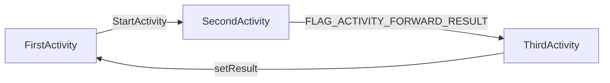

FLAG_ACTIVITY_FORWARD_RESULT:

​	这个flag用于startActivityForResult调用，在intent里设置了这个flag，那么被启动Activity通过setResult设置的结果会传递给启动当前Activity的Activity，如：

​	这个接收Activity的转换过程是在ActivityStackSupervisor的startActivityLocked函数中。

FLAG_ACTIVITY_CLEAR_TASK

​	将被启动Activity的所在task清空

FLAG_ACTIVITY_CLEAR_TOP

​	将被启动Activity所在Task中从top到被启动Activity之间的所有ActivityRecord都清空

FLAG_ACTIVITY_TASK_ON_HOME

​	与FLAG_ACTIVITY_NEW_TASK共同使用，无论上一个Activity是不是Home，task退出（task切换或者被删除）时都会回到Home Activity。

FLAG_EXCLUDE_STOPPED_PACKAGES

​	接收Intent的应用如果处于stopped状态或者是开机后一直没有启动过的，那么Intent不会被dispatch过去。

FLAG_RECEIVER_REGISTERED_ONLY

​	只允许通过registerReceiver注册的BroadcastReceiver接收广播，静态注册的则不能启动新的实例去接收该广播。

FLAG_RECEIVER_REPLACE_PENDING

​	发送广播时，用新的广播替代广播队列里处于等待状态且与当前发送的广播匹配的广播，receiver收到的就是当前更新的广播。

FLAG_RECEIVER_FOREGROUND

​	广播以更高的优先级发送给接收者。默认情况下，广播是在后台队列发送。当设置了这个flag，广播进入前台队列。

