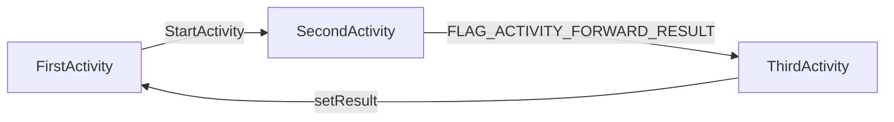

FLAG_ACTIVITY_FORWARD_RESULT:

​	这个flag用于startActivityForResult调用，在intent里设置了这个flag，那么被启动Activity通过setResult设置的结果会传递给启动当前Activity的Activity，如：

​	这个接收Activity的转换过程是在ActivityStackSupervisor的startActivityLocked函数中。

FLAG_ACTIVITY_CLEAR_TASK

​	将被启动Activity的所在task清空

FLAG_ACTIVITY_CLEAR_TOP

​	将被启动Activity所在Task中从top到被启动Activity之间的所有ActivityRecord都清空

FLAG_ACTIVITY_TASK_ON_HOME

​	与FLAG_ACTIVITY_NEW_TASK共同使用，无论上一个Activity是不是Home，task退出（task切换或者被删除）时都会回到Home Activity。