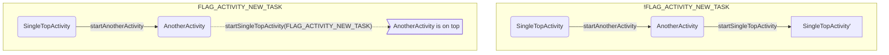

FLAG_MULTIPROCESS:

​	当启动一个新的Activity的时候，如果Activity的flag里有ActivityInfo.FLAG_MULTIPROCESS（在AndroidManifest里有multiprocess声明），并且有启动它的caller（启动新Actiivty的进程，如不是通过am命令启动的），新Activiy的uid是system uid的进程或者新Activity与caller共享同一个userid，那么新Actiivty的processName就是caller的processName。比如，两个进程共享userid，但是包名不同，那么在默认情况下，其实是两个进程名称，如xx.xx.process1和xx.xx.process2。但是如果增加了android:multiprocess="true"的声明，那么xx.xx.process1去start xx.xx.process2里的一个Actiivty，那么这个新的Activity的processName不是xx.xx.process2，而是xx.xx.process1了。

LAUNCH_SINGLE_INSTANCE(android:launchMode="singleInstance"):

​	该launchmode不支持FLAG_ACTIVITY_MULTIPLE_TASK

​	若不是被Activity启动且被指定了要处于哪个task中(即不是从recent启动)，则这个Activity必须是该task的root，否则创建新的task存放Activity。

​	有LAUNCH_SINGLE_INSTANCE 标志的Activity首次启动时要创建新的TaskRecord，再启动一个新的Actiivty时，新的Activity也要创建一个新的TaskRecord，不能与singleInstance的activity在同一个TaskRecord中。

​	系统中只能有一个singleInstance类型Activity的实例。

​	若要启动的Activity已经处于系统中的top，且不需要传递result，再次启动会直接resume，同时调用Activity的onNewIntent。若不是top，则将Actiivty所在的task置顶，使该Activity为top，然后调用Activity的onNewIntent。

​	<span style="color:magenta">回退过程</span>

LAUNCH_SINGLE_TASK(android:launchMode="singleTask):

​	 单独设置成singleTask并不会创建新的task，而是跟随同一应用中启动singleTask的sourceActivity。除非singleTask是应用启动的第一个Activity。

​	若不是被Activity启动且被指定了要处于哪个task中(通常从recent启动会出现这种情况)，则这个Activity必须是该task的root，否则创建新的task存放Activity。

​	<span style="color:cyan">在启动的过程中，会将Activity所在Task中从top到被启动Activity之间的所有ActivityRecord都清空。	</span>

​	 再次启动时，若该Activity已经是top，则不会再启动新的实例。若不是top，则将Actiivty所在的task置顶，将task中该Activity以上的Activity都finish，使该Activity为top，然后调用Activity的onNewIntent。

​	singleTask的Activity启动时，AndroidManifest中若指定了"android:taskAffinity"属性，那么singleTask在启动过程中会查询系统中是否有rootAffinity与Activity中指定的taskAffinity相同的TaskRecord，如果有，singleTask的Activity会进入到这个Task中，如果没有，singleTask的Activity创建并加入这个新的Task（若'android:taskAffinity=""'，即taskAffinity为空，仍然会创建新的Task）。如果没有这个配置，则以app默认的包名为taskAffinity。

​	假设packageName为"app.app.test"的app有三个Activity：ActivityA，SingleTaskActivity，ActivityB，ActivityA启动SingleTaskActivity，SingleTaskActivity启动ActivityB，SingleTaskActivity配置了'android:taskAffinity="com.app..affinity"'与没有配置taskAffinity的两种情况下系统中task对比：

```mermaid
graph BT
subgraph taskAffinity=com.app.affinity
id1-.-id2
subgraph Task:com.app.test
id1(ActivityA)
end
subgraph Task:com.app.affinity
id2(SingleTaskActivity)---id3(ActivityB)
end
end
subgraph no taskAffinity
subgraph Task:com.app.test
id4(ActivityA)---id5(SingleTaskActivity)
id5---id6(ActivityB)
end
end
```

​	单独配置taskAffinity而不与singleTask或singleInstance配合则不会有这个效果，即使系统中没有taskAffinity配置的TaskRecord，也不会创建与taskAffinity配置名称相同的新TaskRecord。若需要这种Task效果，要与singleTask、singleInstance或者Intent.FLAG_ACTIVITY_NEW_TASK配合使用。 	

​	使用隐式方式（如通过action）启动普通Activity时，会在启动Activity所在的Task中创建新的实例；使用隐式方式启动singleTask的Activity时，会将singleTask Activity所在的Task置于到前端，并清空singleTask  Activity以上的Activity，但是Task中singleTask Activity以下的Activity仍然保留。

LAUNCH_SINGLE_TOP(android:launchMode="singleTop"):

​	再次启动（<span style="color:red">显式启动</span>）时，若Activity已经处于所在Task的top，调用Activity的onNewIntent。

​	若该Activity已经是所在task的top，再次启动（<span style="color:red">显式启动</span>）时则不会再创建新的实例，若不是top，则仍然可以有新的实例。但如果启动intent的flag设置了FLAG_ACTIVITY_NEW_TASK&~FLAG_ACTIVITY_MULTIPLE_TASK，那么即使singleTop的Activity不处于top，仍然不会创建新的Activity实例。



