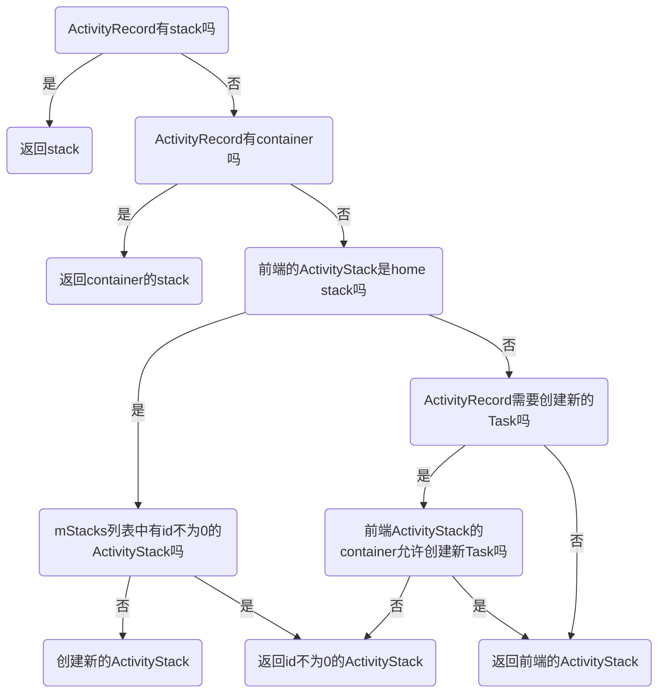

## 				启动第二个Activity

​	假设我们的launcher增加了一个Activity SecondActivity,launcher要启动它，	一般是通过Activity的startActivity实现，与Home的启动类似，也是通过Intent，将被启动的Activity的信息写入Intent，然后传递给AMS，由AMS来启动。与启动Home不同的是，通过startActivity启动时，AMS要在startActivityLocked之前先调用startActivityAsUser,然后调用ActivityStackSupervisor的startActivityMayWait：

```java
final int startActivityMayWait(IApplicationThread caller, int callingUid/*-1*/, String callingPackage/*com.letv.launcher*/, Intent intent, String resolvedType, IVoiceInteractionSession voiceSession/*null*/, IVoiceInteractor voiceInteractor/*null*/,IBinder resultTo, String resultWho, int requestCode, int startFlags/*0*/, ProfilerInfo profilerInfo, WaitResult outResult/*null*/, Configuration config/*null*/, Bundle options, boolean ignoreTargetSecurity/*false*/, int userId, IActivityContainer iContainer/*null*/, TaskRecord inTask/*null*/) {
	......
	ActivityInfo aInfo = resolveActivity(intent, resolvedType, startFlags, profilerInfo, userId);
	......
	int res = startActivityLocked(caller, intent, resolvedType, aInfo,voiceSession, voiceInteractor, resultTo, resultWho,requestCode, callingPid, callingUid, callingPackage,
realCallingPid, realCallingUid, startFlags, options, ignoreTargetSecurity,componentSpecified, null, container, inTask);
    ......
}
```

​	由于SecondActivity是从launcher启动的，所以这里的caller和callingPackage都不是Null，分别是启动HomeActivity时的ApplicationThread对应的Binder和包名，这是一个有caller的Activity了，这对后面判断新Activity应该在哪个ActivityStack和TaskRecord非常重要，这里的requestCode是-1,resultTo是第一个Activity中的mToken，通过它可以找到启动SecondActivity的ActivityRecord。下一步是ActivityStackSupervisor的startActivityLocked：

```java
final int startActivityLocked(IApplicationThread caller,Intent intent, String resolvedType, ActivityInfo aInfo,IVoiceInteractionSession voiceSession, IVoiceInteractor voiceInteractor,
IBinder resultTo, String resultWho, int requestCode,int callingPid, int callingUid, String callingPackage,int realCallingPid, int realCallingUid, int startFlags, Bundle options,boolean ignoreTargetSecurity, boolean componentSpecified, ActivityRecord[] outActivity, ActivityContainer container, TaskRecord inTask) {
	......
     ProcessRecord callerApp = null;
    if (caller != null) {
    	callerApp = mService.getRecordForAppLocked(caller);
    ......
    ActivityRecord sourceRecord = null;
    if (resultTo != null) {
            sourceRecord = isInAnyStackLocked(resultTo);
    .....
        
}
```

​	从AMS的mLruProcesses中得到调用startActivity的source activity的ProcessRecord callerApp，查找系统中所有TaskRecord里有没有source Activity的ActivityRecord sourceRecord。因为HomeActivity在启动的时候，这些信息已经在mLurPorcess和TaskRecord中了，所以这两个值都不会为null。callerApp会被记录到新Activity的ActivityRecord中。找到source activity的ActivityRecord以后，就进入了startActivityUncheckedLocked，startActivityUncheckedLocked里有一些是与启动第一个不同的地方：

```java
final int startActivityUncheckedLocked(final ActivityRecord r, ActivityRecord sourceRecord,
            IVoiceInteractionSession voiceSession/*null*/, IVoiceInteractor voiceInteractor/*null*/, int startFlags,boolean doResume/*true*/, Bundle options, TaskRecord inTask/*null*/) {
   	......
    if (sourceRecord == null && inTask != null && inTask.stack != null){//从recent列表恢复Activity
    ......}else {
            inTask = null;
    }
    ......
    ActivityStack sourceStack;
    if (sourceRecord != null) {
        if (sourceRecord.finishing) {
                if ((launchFlags & Intent.FLAG_ACTIVITY_NEW_TASK) == 0) {
                    launchFlags |= Intent.FLAG_ACTIVITY_NEW_TASK;
                    newTaskInfo = sourceRecord.info;
                    newTaskIntent = sourceRecord.task.intent;
                }
                sourceRecord = null;    
                sourceStack = null;
            } else {
                sourceStack = sourceRecord.task.stack;
            }
        } else {
   		 sourceStack = sourceRecord.task.stack;
    }
    ......
    if (r.resultTo == null && inTask == null && !addingToTask
                && (launchFlags & Intent.FLAG_ACTIVITY_NEW_TASK) != 0) {
    ......
    }else if (sourceRecord != null) {
         final TaskRecord sourceTask = sourceRecord.task;
        targetStack = sourceTask.stack;
        targetStack.moveToFront("sourceStackToFront");
            final TaskRecord topTask = targetStack.topTask();
            if (topTask != sourceTask) {
                targetStack.moveTaskToFrontLocked(sourceTask, noAnimation, options,
                        r.appTimeTracker, "sourceTaskToFront");
            }
        ......
          r.setTask(sourceTask, null);
    }
    ......
    targetStack.mLastPausedActivity = null;
    targetStack.startActivityLocked(r, newTask, doResume, keepCurTransition, options);
                
}
```

​	通过sourceRecord就可以获得sourceRecord所在的TaskRecord和ActivityStack，如果source activity并不是在finish的过程中，那么新activity的ActivityStack就是source的ActivityStack；若source activity正在finish，那么就不能将新Activity放在source activity所在的Task，此时为新Activity添加Intent.FLAG_ACTIVITY_NEW_TASK 的flag，等待创建新的Task。如果在启动应用的时候，Intent里没有加入FLAG_ACTIVITY_NEW_TASK的flag，且在前面的流程中也没有增加FLAG_ACTIVITY_NEW_TASK标志，那么流程进入的就是(sourceRecord != null) ，在这里targetStack.moveToFront将HomeStack放到mStacks的最前端，targetStack.moveTaskToFrontLocked将source activity所在TaskRecord放到所在HomeStack的最前端，最后通过r.setTask将新ActivityRecord从原来所在的task中删除，并将sourceTask赋值给SecondActivity的task,但是SecondActivity并没有放入到sourceTask中，直到调用ActivityStack的startActivityLocked，SecondActivity的ActivityRecord才会进入sourceTask的mActivities列表里。

​	那么，什么情况下启动Activity的时候可以创建ActivityStack呢？新的ActivityStack的创建是通过createStackOnDisplay函数，这个函数被调用的情况一般分以下四种： 系统创建Home ActivityStack，从recent恢复一个task，启动一个新的Activity，SystemUI对系统中的task进行整理。最常见的就是启动一个新的Activity，这时createStackOnDisplay是通过ActivityStackSupervisor.computeStackFocus被调用的，在这里判断是否要创建新的ActivityStack：



​	由此可见，系统中大部分情况下只会创建两个ActivityStack，其中一个是Home Activity。对于普通的应用，基本都在另一个ActivityStack上，只是根据进程不同分别处于不同的Task。

​	Activity与ActivityStack的关系如图：


​	到这里为止，SecondActivity的ActivityRecord已经找到了ActivityStack和TaskRecord，之后在ActivityStack的startActivityLocked函数中从AMS的Lru缓存中找到HomeActivity对应的ProcessRecord，而无需创建新的进程，然后调用resumeTopActivitiesLocked。中间过程与启动HomeActiivty一样，直到resumeTopActivityInnerLocked函数：

```java
private boolean resumeTopActivityInnerLocked(ActivityRecord prev/*ActivityRecord of SecondActivity*/, Bundle options) {
 ......
     final ActivityRecord next = topRunningActivityLocked(null);
 ......
 	mStackSupervisor.mStoppingActivities.remove(next);
    mStackSupervisor.mGoingToSleepActivities.remove(next);
    next.sleeping = false;
    mStackSupervisor.mWaitingVisibleActivities.remove(next);
......
    boolean dontWaitForPause = (next.info.flags&ActivityInfo.FLAG_RESUME_WHILE_PAUSING) != 0;
    boolean pausing = mStackSupervisor.pauseBackStacks(userLeaving, true, dontWaitForPause);
    if (mResumedActivity != null) {
        if (DEBUG_STATES) Slog.d(TAG_STATES,
                "resumeTopActivityLocked: Pausing " + mResumedActivity);
        pausing |= startPausingLocked(userLeaving, false, true, dontWaitForPause);
    }
    if (pausing) {
        if (DEBUG_SWITCH || DEBUG_STATES) Slog.v(TAG_STATES,
                "resumeTopActivityLocked: Skip resume: need to start pausing");
        if (next.app != null && next.app.thread != null) {
            mService.updateLruProcessLocked(next.app, true, null);
        }
        if (DEBUG_STACK) mStackSupervisor.validateTopActivitiesLocked();
        return true;
    }
 ......
    mStackSupervisor.mWaitingVisibleActivities.add(prev);
 ......
    mStackSupervisor.startSpecificActivityLocked(next, true, true);
 ......
}
```

​	 topRunningActivityLocked获取的ActivityRecord是SecondActivity，因为在前面我们已经将SecondActivity的ActivityRecord加入到当前ActivityStack的某一TaskRecord中，并将其放在了top的位置。

​    mStackSupervisor.pauseBackStacks将非本ActivityStack的mResumedActivity进行pause，然后将那个ActivityStack的mResumedActivity置为空，mPausingActivity置为之前resume状态的Activity（mResumedActivity），之后进入Activity的pause流程。pauseBackStacks主要发生在两个ActivityStack切换的时候，如启动一个新进程。如果系统中要启动ActivityStack之外的其他ActivityStack有mResumedActivity不为空，那么就需要pause这个mResumedActivity，进入pause流程，pauseBackStacks的返回结果为true。

​    startPausingLocked是pause当前ActivityStack中的上一个Activity，也就是pause当前ActivityStack中非空的mResumedActivity。通过调用startPausingLocked也将当前ActivityStack的mResumedActivity置为空，mPausingActivity和mLastPausedActivity置为之前resume状态的Activity（mResumedActivity），HomeActivity的ActivityRecord的state此时变成了ActivityState.PAUSING。HomeActivity的ActivityRecord通过ApplicationThread对象与ActivityThread进行通信，执行pause流程。之后ActivityStack设置500ms的定时超时，返回true。

​    startPausingLocked或pauseBackStacks之中任何一个返回true都会使resumeTopActivityInnerLocked中的pausing变成为true，ams则会在此返回。也就是说当startActivity被调用的时候，AMS的主动处理过程到此结束了，之后就是应用对AMS的回调过程了。

​    到此启动新Activity中的主动过程就结束了，之后就是应用处理完自身的pause过程再对AMS进行通知。

​    这时就开始进入应用层了。

​    此时HomeActivity还没有进入finish阶段，所以ApplicationThread传给mH的Message.what是H.PAUSE_ACTIVITY，若要finish则what应该是H.PAUSE_ACTIVITY_FINISHING。

​    ActivityThread根据传过来的IBinder查找ActivityThread的mActivities中缓存的ActivityRecordClient，对这个ActivityRecordClient对象r进行处理。

​    几个回调的发生顺序是：onUserInteraction()->onUserLeaveHint()->onSaveInstanceState()->onPause()->onWindowFocusChanged()

​    在onPause结束后，Activity的mResumed置为false，mFinished仍为false，ActivityRecordClient的paused置为true。在Activity.java里的状态没有mPause的，有的是mResumed、mStopped、mFinished、mDestroyed，ActivityRecord中记录的状态则是startsNotResumed、paused、stopped这三个。

​    到这里AMS收到应用pause结束的消息，开始进入system_server运行。

​    onPause后，ActivityThread会调用AMS中的activityPaused函数来通知AMS这个Activity已经pause了。AMS中有四个回调：activityResumed、activityPaused、activityStopped、activityDestroyed，正好对应Activity.java中的四种状态。activityPaused函数从ActivityStack调用schedulePauseActivity时传入的Token对象token中获取WeakReference对象中存的ActivityRecord，这个ActivityRecord和token是一一对应的。此时获取的ActivityRecord在正常情况下就是前面设置的mPausingActivity，之后进入ActivityStack的completePauseLocked函数，如果completePauseLocked失败了，那么下次就会直接调用finishCurrentActivityLocked进行finish。在completePauseLocked中，如果被pause的Activity已经是当前ActivityStack中的最后一个Activity，那么对系统里的activity，application状态进行清理。

​    completePauseLocked会将prev从mWaitingVisibleActivities中移除，放入ActivityStackSupervisor的mStoppingActivities列表中，mStoppingActivities列表中的Activity都是等待stop的Activity。

​    completePauseLocked的参数resumeNext如果是false，那么不会出现Activity切换的情况，如果是true，那么就要显示系统最顶层的Activity了。ActivityStackSupervisor找到最顶层的ActivityStack topActivityStack对象，然后调用topActivityStack的resumeTopActivitiesLocked函数，之后再次进入resumeTopActivityInnerLocked函数。这时resumeTopActivityInnerLocked运行的部分与上面又不同了：

```java
 private boolean resumeTopActivityInnerLocked(ActivityRecord prev, Bundle options) {
    ......
    boolean pausing = mStackSupervisor.pauseBackStacks(userLeaving, true, dontWaitForPause);
    if (mResumedActivity != null) {
        if (DEBUG_STATES) Slog.d(TAG_STATES,
                "resumeTopActivityLocked: Pausing " + mResumedActivity);
        pausing |= startPausingLocked(userLeaving, false, true, dontWaitForPause);
    }
    ·······
    if (prev != null && prev != next) {
        if (!mStackSupervisor.mWaitingVisibleActivities.contains(prev)&& next != null && !next.nowVisible) {
            mStackSupervisor.mWaitingVisibleActivities.add(prev);
    ......
     ActivityStack lastStack = mStackSupervisor.getLastStack();
    if (next.app != null && next.app.thread != null) {
     ······
    }else{
        ......
        mStackSupervisor.startSpecificActivityLocked(next, true, true);
    }
   
 }
```

​	resumeTopActivitiesLocked函数的参数prev如果是启动新Activity的时候，它是新启动的Activity对应的ActivityRecord，与当前ActivityStack中的top Activity相同，如果是旧的Actiivty pause以后回调AMS的时候，prev是被pause的activity，与当前ActivityStack中的top Activity不同。当获取的top activity是空时，表示当前ActivityStack已经被清空，没有Activity了，此时要启动系统中stackID为0的HomeStack的Activity。HomeStack在有launcher的情况下是launcher所在的ActivityStack，没有launher时HomeStack仍然存在，只是在启动systemui等其他应用前里面是空的。此时，如果next就是新的Activity且是RESUMED状态，就开始准备过场动画。如果系统中每个ActivityStack的mPausingActivity并不处于pause、stopped或stopping状态，resumeTopActivityInnerLocked就会在这里返回。

​    由于我们在前面的start过程中已经pause了backStack，也pause了当前stack的其他Activity，所以这里的pausing就变成了false，函数会继续执行下去,而不是像之前那样在这里返回。

​    ActivityStackSupervisor里有个变量是mWaitingVisibleActivities，这是个list，list里的Activity表示正在等待其他Activity可见，也就是list里的Activity应该处于pause或stop状态了，而新的Activity还没有resume，这个pause或stop状态的Activity则要在这里等待被invisible。在prev的pause阶段，如果prev不在mWaitingVisibleActivities里，next也不为空且没有resume，那么就会将prev放入这个list中，否则此时由WindowManagerService将prev的window隐藏，而新Activity的时候start阶段则没有这个隐藏prev的过程。

​    之后WindowManagerService开始准备Activity的动画效果了。在启动系统中的第一个Activity的时候是没有动画效果的；如果prev还没有finish，且prev和next是在同一个TaskRecord里，准备的是类型为TRANSIT_ACTIVITY_OPEN的动画，若不在同一个TaskRecord中则准备的是类型为TRANSIT_TASK_OPEN的动画；若prev处于finishing状态，且prev和next是在同一个TaskRecord里，准备的是TRANSIT_ACTIVITY_CLOSE动画，若不在同一个TaskRecord中则准备的是类型为TRANSIT_TASK_CLOSE的动画。另外还可以在启动Activity的Intent中配置FLAG_ACTIVITY_NO_ANIMATION，使Activity启动的时候没有动画效果。

​       如果进行到这一步就开始显示next了，也就是我们启动的第二个Activity。

​	SecondActivity的启动过程中，ProcessRecord不需要重新创建了，通过ActivityRecord的ProcessName可以从AMS的mProcessNames缓存中获取到了，这个ProcessRecord与HomeActivity的ProcessRecord是同一个。后面的过程与启动HomeActivity是一样的了。

​	handleResumeActivity之后是由WindowManagerService对Activity的界面和Window进行处理了，过程中包括View的加载、window的生成以及与Activity中View相关的回调都是由WMS处理过程中的状态触发，在这个过程中ViewRootImpl,Choreographer都会给mH的Looper发消息，处理这些跟绘制和显示有关的函数。Activity的进入动画结束时，Activity的onEnterAnimationComplete会被回调，SecondActivity的显示过程就结束了，此时WMS会回调SecondActivity的ActivityRecord对应的ApplicationToken对象的windowsVisible函数，这个函数会通知SecondActivity的ActivityRecord它的Window已经是visible状态了，并将ActivityRecord的nowVisible置为true，此时就可以进行stop上一个Activity的操作了。

​	在start SecondActivity的整个显示过程中，有很多的回调被执行：

​	onApplyThemeResource->onCreate-> onWindowAttributesChanged-> onCreateView-> onContentChanged-> onStart-> onPostCreate->(onActivityResult->) onStateNotSaved-> (onNewIntent->)onResume-> onPostResume-> onAttachedToWindow-> onCreatePanelView-> onCreatePanelMenu-> onCreateOptionsMenu-> onPreparePanel-> onPrepareOptionsMenu-> onWindowFocusChanged-> onEnterAnimationComplete（这是一个让人忧伤的长列表）

​	上一个Activity的stop是通过AMS的activityIdleInternalLocked实现的，但是什么时候stop却要看SecondActivity的运行状态（因为当mH中的Message都处理完了，才开始处理之前安排的Idler）：

​	1.如果SecondActivity的绘制较快，mH先进入idle状态，那么activityIdleInternalLocked先执行，ActivityRecord里的状态量idle会被置为true，之后收到WMS的windowsVisible回调时，会清空mWaitingVisibleActivities里等待的Activity，并通知ActivityStackSupervisor调用activityIdleInternalLocked清理mStoppingActivities里的Activity，此时HomeActivity被stop；

​	2.如果WMS的windowsVisible回调先到，此时mH还没处于idle状态，ActivityRecord里的状态量idle仍然为false，ActivityRecord会调用processStoppingActivitie sLocked函数将既在mStoppingActivities中又在mWaitingVisibleActivities中的ActivityRecord从mWaitingVisibleActivities中删除，等待mH处于idle时再进行stop，并通过WMS把finishing为true的ActivityRecord对应的window隐藏。

​	这里要注意的是Idler在定义的时候，在它的queueIdle函数里返回的是false，那么这个Idler执行一次后就会从mH的MessageQueue中删除，所以只有这个Activity每次resume的时候，这个Idler才会安排运行一次，也就是由新的Activity主动去清理其他Activity的机会每次resume的时候才会有一次。

​	如果HomeActivity的启动intent或者ActivityInfo中有FLAG_NO_HISTORY标志，这个Activity就会直接finish，而没有stop过程。对于其他的Activity，state置为ActivityState.STOPPING，在stop操作成功前stopped置为false.AMS开始调用scheduleStopActivity。scheduleStopActivity会传入一个参数r.visible，能看得见Activity时r.visible就是true，看不见r.visible就是false，比如最前端的Activity设置成了对话框的主题，那么后面的Activity的visible也是true，但如果最前端的Activity是全屏的，那么visible就是false。因为visible的不同，传入scheduleStopActivity后的处理就会不同：

​	1.如果被stop的ActivityRecord的visible为true，ApplicationThread会给mH发STOP_ACTIVITY_SHOW消息，ApplicationThread调用handleStopActivity函数，其中一个参数show传入的是true，这个show决定了被覆盖的Activity是否真的stop。因为show为true，则不会stop，只将对应ActivityRecordClient的pause置为true；

​	2.如果被stop的ActivityRecord的visible为false，ApplicationThread会给mH发STOP_ACTIVITY_HIDE消息，ApplicationThread调用handleStopActivity函数，show传入false，这表示被覆盖的Activity要进行真正的stop，开始会处理HomeActivity的Window，fragment和打开的数据库Cursor，之后将Activity的mStopped置为true，mResumed置为false，ActivityRecordClient的stopped和paused都置为true。 

​	但是Activity被Dialog覆盖的时候，Activity并不会stop，但是会触发Activity的onWindowFocusChanged。

​    之后通知AMS有一个Activity已经stop了，AMS从系统中的ActivityStack中找到token对应的ActivityRecord，然后调用ActiivtyStack的activityStoppedLocked。将ActivityREcord的stopped置为tre，state 置为ActivityState.STOPPED，AMS里有个变量mPreviousProcess，表示AMS之前处理的进程，如果是进程间切换启动Activity，且前一个进程不是Home进程，那么mPreviousProcess会被置为前一个进程的ProcessRecord，如果是进程内的Activity切换，那么这个变量其实已经是新Activity所在的进程了。

​	Home Activity在stop的过程中也有一些回调：

​	onCreateDescription()->onSaveInstanceState()->onStop()

​	了解这些回调的时机，代码才不会写错地方^o^

```mermaid
sequenceDiagram
	participant WMS as WindowManagerService
	participant AMS as ActivityManagerService
	participant ASS as ActivityStackSupervisor
	participant AS as ActivityStack
	participant APT as ApplicationThread
	participant AT as ActivityThread
	participant AP as Application
	participant A as HomeActivity
	participant ASE as SecondActivity
	
	AMS->>ASS:startActivityMayWait()
	ASS->>ASS:startActivityLocked()
	ASS->>ASS:startActivityUncheckedLocked()
	ASS->>AS: startActivityLocked()
	AS->>ASS: resumeTopActivitiesLocked()
	ASS->>AS:resumeTopAcivityLocked()
	AS->>+AS:resumeTopActivityInnerLocked()
	AS->>ASS:pauseBackStacks()
	AS->>-AS:startPausingLocked()
	AS--xAPT:schedulePauseActivity()
	APT-->>+AT:handlePauseActivity()
	AT-->>A:onUserInteraction()
	AT-->>A:onUserLeaveHint()
	AT-->>A:onSaveInstanceState()
	AT-->>-A:>onPause()
	AT--xAMS:activityPaused()
	AMS->>AS:activityPausedLocked()
	AS->>AS:completePauseLocked()
	AS->>ASS:resumeTopActivitiesLocked()
	ASS->>AS:resumeTopActivityLocked()
	AS->>AS:resumeTopActivityInnerLocked()
	AS->>+ASS:startSpecificActivityLocked();
	ASS->>AMS:getProcessRecordLocked()
	AS->>-ASS:realStartActivityLocked()
	ASS--xAPT:scheduleLaunchActivity()
	APT-->>AT:handleLaunchActivity()
	AT-->>+AT:performLaunchActivity()
	AT-->>AP:onCreate()
	AT-->>A:onCreate()
	AT-->>A:onStart()
	AT-->>A:onRestoreInstanceState()
	AT-->>-A:onPostCreate()
	AT-->>+AT:handleResumeActivity()
	AT-->>A:onStateNotSaved()
	AT-->>A:performResume()
	A-->>A:onResume()
	A-->>-A:onPostResume()
	WMS--xA:onEnterAnimationComplete()
	AT--xAMS:activityIdle（）
	AMS-->ASS:activityIdleInternalLocked（）
	ASS->>AS:stopActivityLocked()
	AS--xAPT:scheduleStopActivity()
	APT-->>+AT:handleStopActivity()
	AT-->>A:onCreateDescription()
	A-->>A:onSaveInstanceState()
	A-->>-A:onStop()
	AT--xAMS:activityStopped()
```

​	


