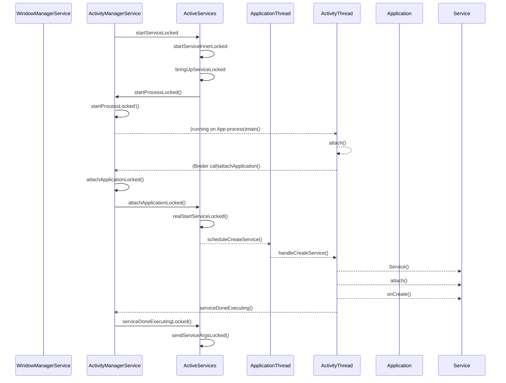

# Service

startService：

​	通过startService启动service是先声明一个Intent，通过ContextImpl的startService启动，其调用的是ContextImpl的startServiceCommon：

```java
    private ComponentName startServiceCommon(Intent service, UserHandle user) {
        try {
            validateServiceIntent(service);
            service.prepareToLeaveProcess();
            ComponentName cn = ActivityManagerNative.getDefault().startService(
                mMainThread.getApplicationThread(), service, service.resolveTypeIfNeeded(
                            getContentResolver()), getOpPackageName(), user.getIdentifier());
            if (cn != null) {
                if (cn.getPackageName().equals("!")) {
                    throw new SecurityException(
                            "Not allowed to start service " + service
                            + " without permission " + cn.getClassName());
                } else if (cn.getPackageName().equals("!!")) {
                    throw new SecurityException(
                            "Unable to start service " + service
                            + ": " + cn.getClassName());
                }
            }
            return cn;
        } catch (RemoteException e) {
            throw new RuntimeException("Failure from system", e);
        }
    }
```

​		validateServiceIntent是检查启动service的Intent格式是否符合要求。对于api为21及以上的Intent，要求加入被启动service的component或package信息，也就是显示启动service，否则就会报错。

​		service的具体启动是通过AMS的startService方法,进一步调用ActiveServices的startServiceLocked方法：

```java
	    ComponentName startServiceLocked(IApplicationThread caller, Intent service, String resolvedType,int callingPid, int callingUid, String callingPackage, int userId)
            throws TransactionTooLargeException {
        ......
        final boolean callerFg;
    1)  if (caller != null) {
            final ProcessRecord callerApp = mAm.getRecordForAppLocked(caller);
            if (callerApp == null) {
                throw new SecurityException(......);
            }
            callerFg = callerApp.setSchedGroup != Process.THREAD_GROUP_BG_NONINTERACTIVE;
        } else {
            callerFg = true;
        }
    2)  ServiceLookupResult res =
            retrieveServiceLocked(service, resolvedType, callingPackage,
                    callingPid, callingUid, userId, true, callerFg);
    3)  if (res == null) {
            return null;
        }
        if (res.record == null) {
            return new ComponentName("!", res.permission != null
                          ? res.permission : "private to package");
        }
        ServiceRecord r = res.record;
				.......
    4)  if (unscheduleServiceRestartLocked(r, callingUid, false)) {
         			if (DEBUG_SERVICE) Slog.v(TAG_SERVICE, "START SERVICE WHILE RESTART PENDING: " + r);
        }
 				......
        r.lastActivity = SystemClock.uptimeMillis();
        r.startRequested = true;
        r.delayedStop = false;
        r.pendingStarts.add(new ServiceRecord.StartItem(r, false, r.makeNextStartId(),
                service, neededGrants));
        final ServiceMap smap = getServiceMap(r.userId);
        boolean addToStarting = false;
    5)  if (!callerFg && r.app == null && mAm.mStartedUsers.get(r.userId) != null) {
            ProcessRecord proc = mAm.getProcessRecordLocked(r.processName, r.appInfo.uid, false);
            if (proc == null || proc.curProcState > ActivityManager.PROCESS_STATE_RECEIVER) {
               	......
                if (smap.mStartingBackground.size() >= mMaxStartingBackground) {
                    // Something else is starting, delay!
                    Slog.i(TAG_SERVICE, "Delaying start of: " + r);
                    smap.mDelayedStartList.add(r);
                    r.delayed = true;
                    return r.name;
                }
                if (DEBUG_DELAYED_STARTS) Slog.v(TAG_SERVICE, "Not delaying: " + r);
                addToStarting = true;
            } else if (proc.curProcState >= ActivityManager.PROCESS_STATE_SERVICE) {
                // We slightly loosen when we will enqueue this new service as a background
                // starting service we are waiting for, to also include processes that are
                // currently running other services or receivers.
                addToStarting = true;
                if (DEBUG_DELAYED_STARTS) Slog.v(TAG_SERVICE,
                        "Not delaying, but counting as bg: " + r);
            } 
      	......
        return startServiceInnerLocked(smap, service, r, callerFg, addToStarting);
    }
```

​	 1. if (caller != null)的判断用来区分要启动service的进程caller是否是system_server，若是system_server，则caller是null，此时callerFg被赋值为true；若caller不为null，则要看caller是否是与用户交互的进程，若不与用户交互，也就是setSchedGroup的值为Process.THREAD_GROUP_BG_NONINTERACTIVE，callerFg被赋值为false，若是与用户交互的进程，则callerFg被赋值为true。

​	2.ActiveServices里有一个类ServiceMap，继承自Handler，里面有两个ArrayMap：mServicesByName，mServicesByIntent，用于存储被启动过的Service对应的ServiceRecord。mServicesByName的key是Intent的ComponentName，value是service的ServiceRecord；mServicesByIntent的key是Intent.FilterComparison，value是service的ServiceRecord，Intent.FilterComparison其实存储的就是Intent对象。

​		retrieveServiceLocked函数先在ServiceMap里查找intent对应的ServiceRecord，若有且经过一系列判断可以启动，返回ServiceLookupResult对象，其中包含的就是ServiceRecord对象；若在ServiceMap里没有对应的ServiceRecord，则会创建新的ServiceRecord对象，并保存到ServiceMap的两个ArrayMap中，此时则会有两种返回值，null和ServiceLookupResult。返回null的情况：PackageManagerService中没有找到对应的service信息、IntentFirewall拒绝这个intent、service需要独立的permission且PKMAS权限检查通过了但是AppOpsManager不允许这样操作、对应的ServiceRecord无论如何都是null；返回ServiceLookupResult的情况：PKMS的权限检查不是PERMISSION_GRANTED（此时返回的ServiceLookupResult包含的ServiceRecord对象是null）、各种检查都顺利通过（此时返回的ServiceLookupResult包含的ServiceRecord对象就是service对应的ServiceRecord了）。

​	3.retrieveServiceLocked的返回值会影响startServiceLocked的返回结果，进一步影响ContextImpl的startServiceCommon函数对返回结果的判断：retrieveServiceLocked返回空，则startServiceCommon也返回空，此时需要判断返回值才能知道服务是否启动成功；retrieveServiceLocked返回的ServiceLookupResult里的ServiceRecord为空，则返回给startServiceCommon的是一个mPackage为“！”的ComponentName对象，这使得startServiceCommon会抛出一个权限错误的Exception，我们也就知道了服务启动失败了。

​	4.unscheduleServiceRestartLocked从ActiveServices的mRestartingServices列表中将ServiceRecord移除，这个列表存储的是crash过而被安排重新启动的ServiceRecord。同时清除ServiceRecord里与service重启相关的数据：restartCount、restartDelay、restartTime。我们手动启动或停止这个service，则不需要系统对它再进行重启操作了。

​		对ServiceRecord的状态进行更新：startRequested=true，elayedStop = false，在pendingStarts里加入包含启动intent信息的ServiceRecord.StartItem对象。

​	5.如果是非交互进程在启动service，且该service首次启动，则该Service有可能会被延迟启动（system_server除外，它启动的service都是立即启动）。首先获取service所在进程的ProcessRecord，如果service所在的进程没启动或者进程当前状态值高于ActivityManager.PROCESS_STATE_RECEIVER，这表示进程虽然在后台运行但是比较重要或者有BroadcastReceiver、Service之类的任务在执行，service会进入启动流程。但是如果当前系统中由非交互进程启动的服务数量（mStartingBackground.size()）超过mMaxStartingBackground（这个值可以通过ro.config.max_starting_bg设置，默认情况下低内存设备该值为1，其他设备该值为8），该service就会被delay启动，进入的是ServiceMap的mDelayedStartList列表，ServiceRecord的delayed被标记为true，表示延迟启动。

​	之后进一步调用startServiceInnerLocked：

```java
    ComponentName startServiceInnerLocked(ServiceMap smap, Intent service, ServiceRecord r,
            boolean callerFg, boolean addToStarting) throws TransactionTooLargeException {
        ProcessStats.ServiceState stracker = r.getTracker();
        ......
        r.callStart = false;
       .....
     String error = bringUpServiceLocked(r, service.getFlags(), callerFg, false);
        if (error != null) {
            return new ComponentName("!!", error);
        }
				......
        return r.name;
    }
```

​		startServiceInnerLocked里进一步调用了bringUpServiceLocked

```java
    private final String bringUpServiceLocked(ServiceRecord r, int intentFlags, boolean execInFg, boolean whileRestarting) throws TransactionTooLargeException {
    ......
1.1) if (r.app != null && r.app.thread != null) {
           sendServiceArgsLocked(r, execInFg, false);
           return null;
     }
1.2) if (r.delayed) {
          getServiceMap(r.userId).mDelayedStartList.remove(r);
          r.delayed = false;
        }
    }
 		ProcessRecord app;
		......
1.3) final boolean isolated = (r.serviceInfo.flags&ServiceInfo.FLAG_ISOLATED_PROCESS) != 0;
      final String procName = r.processName;
      ProcessRecord app;
			if (!isolated) {
            app = mAm.getProcessRecordLocked(procName, r.appInfo.uid, false);
						......
            if (app != null && app.thread != null) {
                try {
                    app.addPackage(r.appInfo.packageName, r.appInfo.versionCode, mAm.mProcessStats);
                    realStartServiceLocked(r, app, execInFg);
                    return null;
						......
            }
        }
1.4)// Not running -- get it started, and enqueue this service record
        // to be executed when the app comes up.
        if (app == null) {
            if ((app=mAm.startProcessLocked(procName, r.appInfo, true, intentFlags,
                    "service", r.name, false, isolated, false)) == null) {
                String msg = "Unable to launch app "
                        + r.appInfo.packageName + "/"
                        + r.appInfo.uid + " for service "
                        + r.intent.getIntent() + ": process is bad";
                Slog.w(TAG, msg);
                bringDownServiceLocked(r);
                return msg;
            }
            if (isolated) {
                r.isolatedProc = app;
            }
        }
1.5)if (!mPendingServices.contains(r)) {
            mPendingServices.add(r);
        }
    return null;
```

​		1.1 如果service已经启动过了并且其进程还活着，那么直接将参数发送给对应的service，调用其onStartCommand（）。

​		1.2 如果该service之前被安排进入了mDelayedStartList列表，而此时正是启动这个service的流程，所以将它从mDelayedStartList中移除，并将ServiceRecord.delayed置为false。

​    	1.3 根据ServiceRecord的processName从AMS的mProcessNames列表中获取相应的ProcessRecord，若存在则调用realStartServiceLocked开始创建Service对象并返回null，表示启动Service过程正常执行。若bringUpServiceLocked的返回值非空，则表示启动过程中出错了，startServiceInnerLocked判断这个返回值非空则会返回给ContextImpl一个ComponentName("!!", error)对象，这个对象会导致ContextImpl的startServiceCommon函数抛出一个SecurityException。

​		1.4 若service所在的进程没有启动过，即上一步（1.3）获取到的ProcessRecord为null，则先启动进程。由于进程的启动与Ams的启动Service过程不是同步的，所以这里获取到进程的对象后即进入下一步

​		1.5 若进行到这里，说明Service还没启动，将ServiceRecord加入到mPendingServices列表中，等带进程创建完成后从mPendingServices中获取ServiceRecord进行启动。

​		承载Service进程的启动过程与启动Activity时启动进程的过程是一样的，直到ActivityManagerService的attachApplicationLocked方法。在这个方法里启动会对需要启动的Activity和Service都进行判断，若有则对应的组件被启动：

```java
 private final boolean attachApplicationLocked(IApplicationThread thread,int pid) {
  	......
      // See if the top visible activity is waiting to run in this process...
     if (normalMode) {
            try {
                if (mStackSupervisor.attachApplicationLocked(app)) {
                    didSomething = true;
                }
            } catch (Exception e) {
                Slog.wtf(TAG, "Exception thrown launching activities in " + app, e);
                badApp = true;
            }
        }

        // Find any services that should be running in this process...
        if (!badApp) {
            try {
                didSomething |= mServices.attachApplicationLocked(app, processName);
            } catch (Exception e) {
                Slog.wtf(TAG, "Exception thrown starting services in " + app, e);
                badApp = true;
            }
        }

        // Check if a next-broadcast receiver is in this process...
        if (!badApp && isPendingBroadcastProcessLocked(pid)) {
            try {
                didSomething |= sendPendingBroadcastsLocked(app);
            } catch (Exception e) {
                // If the app died trying to launch the receiver we declare it 'bad'
                Slog.wtf(TAG, "Exception thrown dispatching broadcasts in " + app, e);
                badApp = true;
            }
        }
 }
```

​	mStackSupervisor.attachApplicationLocked启动Activity，mServices.attachApplicationLocked则启动Service，sendPendingBroadcastsLocked将等待中的广播发送给新创建的进程。

​		ActiveService的启动Service代码如下：

```java
 boolean attachApplicationLocked(ProcessRecord proc, String processName)
            throws RemoteException {
        boolean didSomething = false;
        // Collect any services that are waiting for this process to come up.
        if (mPendingServices.size() > 0) {
            ServiceRecord sr = null;
            try {
2.1）           for (int i=0; i<mPendingServices.size(); i++) {
                    sr = mPendingServices.get(i);
                    if (proc != sr.isolatedProc && (proc.uid != sr.appInfo.uid
                            || !processName.equals(sr.processName))) {
                        continue;
                    }
                    mPendingServices.remove(i);
                    i--;
                    proc.addPackage(sr.appInfo.packageName, sr.appInfo.versionCode,
                            mAm.mProcessStats);
2.2）               realStartServiceLocked(sr, proc, sr.createdFromFg);
                    didSomething = true;
2.3）                if (!isServiceNeeded(sr, false, false)) {
                     ......
                        bringDownServiceLocked(sr);
                    }
                }
            } catch (RemoteException e) {
                Slog.w(TAG, "Exception in new application when starting service "
                        + sr.shortName, e);
                throw e;
            }
        }
				......
2.4）   if (mRestartingServices.size() > 0) {
            ServiceRecord sr;
            for (int i=0; i<mRestartingServices.size(); i++) {
                sr = mRestartingServices.get(i);
                if (proc != sr.isolatedProc && (proc.uid != sr.appInfo.uid
                        || !processName.equals(sr.processName))) {
                    continue;
                }
                mAm.mHandler.removeCallbacks(sr.restarter);
                mAm.mHandler.post(sr.restarter);
            }
        }
        return didSomething;
    }
```

​		2.1）遍历mPendingServices列表，查找属于新启动ProcessRecord的ServiceRecord。mPendingServices是在进程启动完成之前存储ServiceRecord的列表，进程启动后从这个列表中取出相应的ServiceRecord对象启动对应的Service。

​		2.2）realStartServiceLocked将Service启动起来。

​		2.3）如果Service不需要了，也就是既不是用户要求启动的也没有任何ServiceConnection存在，停止该Service。

​		2.4）如果Service因为crash而被重启，会被加入到mRestartingServices列表中，当进程启动后这些需要重启的Service就可以在此时通过AMS被启动了。

​			realStartServiceLocked是将Service启动起来的函数：

```java
    private final void realStartServiceLocked(ServiceRecord r,
            ProcessRecord app, boolean execInFg) throws RemoteException {
    ......
      try{
2.2.1)  r.app = app;
        r.restartTime = r.lastActivity = SystemClock.uptimeMillis();
        final boolean newService = app.services.add(r); 
2.2.2)  bumpServiceExecutingLocked(r, execInFg, "create");
        mAm.updateLruProcessLocked(app, false, null);
        mAm.updateOomAdjLocked();
        ......
2.2.3)  app.thread.scheduleCreateService(r, r.serviceInfo,
                    mAm.compatibilityInfoForPackageLocked(r.serviceInfo.applicationInfo),
                    app.repProcState);
        ......
        created = true;
      }  finally {
2.2.4)      if (!created) {
                // Keep the executeNesting count accurate.
                final boolean inDestroying = mDestroyingServices.contains(r);
                serviceDoneExecutingLocked(r, inDestroying, inDestroying);
                // Cleanup.
                if (newService) {
                    app.services.remove(r);
                    r.app = null;
                }
                // Retry.
                if (!inDestroying) {
                    scheduleServiceRestartLocked(r, false);
                }
            }
        }
        // If the service is in the started state, and there are no
        // pending arguments, then fake up one so its onStartCommand() will
        // be called.
2.2.5)  if (r.startRequested && r.callStart && r.pendingStarts.size() == 0) {
            r.pendingStarts.add(new ServiceRecord.StartItem(r, false, r.makeNextStartId(),
                    null, null));
        }

        sendServiceArgsLocked(r, execInFg, true);
    }
```

​		2.2.1）通过 r.app = app将ServiceRecord和PorcessRecord进行关联，并把ServiceRecord加入到ProcessRecord.services列表。

​		2.2.2)  bumpServiceExecutingLocked将ServiceRecord加入到ProcessRecord.executingServices列表，并为Service的启动设置超时时间：如果Service会在前台执行，超时时间是20s；如果Service不会在前台执行，超时时间是200s。更新ProcessRecord app在AMS的mLruProcesses列表中的位置。更新进程的adj。

​		2.2.3) 通过ApplicationThread启动Service。		

​		当system_server通过ApplicationThread启动Service的时候，调用的是ApplicationThread的scheduleCreateService，首先将进程的mLastProcessState更新成ActivityManager.PROCESS_STATE_SERVICE，这用来通知虚拟机当前进程的状态。之后通过H调用ActivityThread.handleCreateService:

```java
private void handleCreateService(CreateServiceData data) {
  ......
    LoadedApk packageInfo = getPackageInfoNoCheck(
                data.info.applicationInfo, data.compatInfo);
    Service service = null;
    try {
        java.lang.ClassLoader cl = packageInfo.getClassLoader();
        service = (Service) cl.loadClass(data.info.name).newInstance();  
   ......
   try {
     ......
   					ContextImpl context = ContextImpl.createAppContext(this, packageInfo);
            context.setOuterContext(service);

            Application app = packageInfo.makeApplication(false, mInstrumentation);
            service.attach(context, this, data.info.name, data.token, app,
                    ActivityManagerNative.getDefault());
            service.onCreate();
            mServices.put(data.token, service);
            try {
                ActivityManagerNative.getDefault().serviceDoneExecuting(
                        data.token, SERVICE_DONE_EXECUTING_ANON, 0, 0);
       ......
   }
  ......
}
```

​		之后通过Classloader初始化Service对象，并调用Service.attach为Service对象传递Context，ActiivtyThread，ApplicationThread对象等。调用Service.onCreate。

​		ActivityThread里有个 ArrayMap<IBinder, Service> mServices列表，里面存储的是当前进程中的Service对象，以ServiceRecord为key，生成的Service对象为value。当AMS对Service进行bind、unbind、stop、传参数等操作时，都要从这个列表中获取Service对象。

​		Service创建完成并加入mServices列表后，ActivityThread通过AMS的serviceDoneExecuting函数通知ActiveServices。serviceDoneExecuting函数的第二个参数表示Service对象的当前状态，其取值有SERVICE_DONE_EXECUTING_ANON（异步操作）、SERVICE_DONE_EXECUTING_START（onStart已调用）和SERVICE_DONE_EXECUTING_STOP（Service已stop/destroy）。根据这个参数的不同值，ActiveServices会对Service进行不同的操作。

​		ActiveServices的serviceDoneExecutingLocked(ServiceRecord, int , int, int)处理从ActivityThread.serviceDoneExecuting通过AMS.serviceDoneExecuting传递过来的ServiceRecord和Service对象的当前状态值SERVICE_DONE_EXECUTING_ANON，对这个状态值ActiveServices不做处理。最后调用serviceDoneExecutingLocked处理ServiceRecord，如果ServiceRecor.executeNesting<=0，表示Service不再运行了，开始清除ServiceRecord的状态。

​			2.2.4) 这里对没有成功启动Service进行一次处理，如果service启动失败但是不应该销毁（未被调用bringDownServiceLocked），则重试一次。

​		2.2.5) 如果已经启动过Service且pendingStarts列表为空，则添加一个空的ServiceRecord.StartItem到ServiceRecord.pendingStarts，这样Service的onStartCommand()]才会被调用，对于首次启动的Service，在startServiceLocked阶段已经加入了包含Intent的ServiceRecord.StartItem。之后通过sendServiceArgsLocked传参数给Service。sendServiceArgsLocked从pendingStarts列表中获取ServiceRecord.StartItem对象，并加入到ServiceRecord的deliveredStarts列表中，StartItem的deliveryCount加1，deliveryCount若大于1，表示正在重试发送参数给onStartCommand。

​		




​	ts.new_cbonds()

ts.get_realtime_quotes(['sh','110051'])

