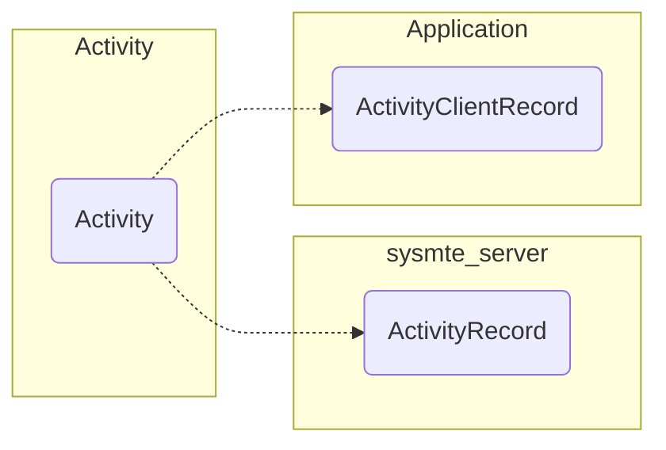

##		Activity情景系列—HomeActivity的启动	

​	HomeActivity的启动是在AMS里，第一次启动是在systemReady函数里，通过startHomeActivityLocked实现，首先获取HomeIntent：

```java
    Intent getHomeIntent() {
        Intent intent = new Intent(mTopAction/*Intent.ACTION_MAIN*/, mTopData/*Null*/ != null ? Uri.parse(mTopData) : null);
        intent.setComponent(mTopComponent/*Null*/);
        if (mFactoryTest != FactoryTest.FACTORY_TEST_LOW_LEVEL) {
            intent.addCategory(Intent.CATEGORY_HOME);
        }
        return intent;
    }
```

​	这是一个没有Component，没有Uri，只有Action和Category的Intent，但是Category “android.intent.category.HOME”是比较特殊的，它表示这是一个Home Activity，是系统开机后显示的第一个Actiivty。但是仅有这个Intent是不知道它是哪个Activity的，还要从PKMS中获取具体的Activity信息aInfo，才能start这个Home Activity。获取到对应的Intent后，AMS为这个Intent增加一个FLAG_ACTIVITY_NEW_TASK的flag，然后调用mStackSupervisor.startHomeActivity(intent, aInfo, reason/*systemReady*/);mStackSupervisor.startHomeActivity会再调用startActivityLockd：

```java
 startActivityLocked(null /* caller */, intent, null /* resolvedType */, aInfo,
                null /* voiceSession */, null /* voiceInteractor */, null /* resultTo */,
                null /* resultWho */, 0 /* requestCode */, 0 /* callingPid */, 0 /* callingUid */,
                null /* callingPackage */, 0 /* realCallingPid */, 0 /* realCallingUid */,
                0 /* startFlags */, null /* options */, false /* ignoreTargetSecurity */,
                false /* componentSpecified */,
                null /* outActivity */, null /* container */,  null /* inTask */);
```

​		这里会为HomeActicity创建一个ActivityRecord对象，用来记录这个Activity的信息。每个Activity在system_server进程中以ActiivtyRecord对象表示，在应用端以ActivityClientRecord表示。如下图：



​	之后调用startActivityUncheckedLocked，这里会判断Activity的launchMode，launchMode的配置是在AndroidManifest中，具体是四种取值：standard，singleTop，singleTask，singleInstance，会影响Activity所在的ActivityStack和TaskRecord。

​	在SystemServer的startOtherService阶段创建了一个id为HOME_STACK_ID（==0）的ActivityStack，被命名为mHomeStack，这是launcher、systemui等进程所在的ActivityStack。通过moveToFront将新创建的ActivityStack置于front，所说的置于front也就是将新创建的ActivityStack放在mStacks列表的最后，mStacks列表保存着为同一个displayid（如Display.DEFAULT_DISPLAY）所创建的所有ActivityStack。此时ActivityStackSupevisor中的mFocusedStack被置为mStacks列表中的顶层ActivityStack，也就是mHomeStack。

​	在startActivityUncheckedLocked函数中会创建一个id为0的TaskRecord，并添加到mHomeStack的mTaskHistory列表中。之后调用ActivityStack的startActivityLocked。这里会将前面生成的ActivityRecor的放到TaskRecord里mActivities的队尾，准备启动Activity的window动画:

```java
final void startActivityLocked(ActivityRecord r, boolean newTask,
            boolean doResume, boolean keepCurTransition, Bundle options) {
	......
	if (!r.mLaunchTaskBehind && (taskForIdLocked(taskId) == null || newTask)) {
            insertTaskAtTop(rTask, r);
            mWindowManager.moveTaskToTop(taskId);
    }
    ......
     if (!isHomeStack() || numActivities() > 0) {
            // We want to show the starting preview window if we are
            // switching to a new task, or the next activity's process is
            // not currently running.
            boolean showStartingIcon = newTask;
            ProcessRecord proc = r.app;
            if (proc == null) {
                proc = mService.mProcessNames.get(r.processName, r.info.applicationInfo.uid);
            }
            if (proc == null || proc.thread == null) {
                showStartingIcon = true;
            }
            if (DEBUG_TRANSITION) Slog.v(TAG_TRANSITION,
                    "Prepare open transition: starting " + r);
            if ((r.intent.getFlags() & Intent.FLAG_ACTIVITY_NO_ANIMATION) != 0) {
                mWindowManager.prepareAppTransition(AppTransition.TRANSIT_NONE, keepCurTransition);
                mNoAnimActivities.add(r);
            } else {
                mWindowManager.prepareAppTransition(newTask
                        ? r.mLaunchTaskBehind
                                ? AppTransition.TRANSIT_TASK_OPEN_BEHIND
                                : AppTransition.TRANSIT_TASK_OPEN
                        : AppTransition.TRANSIT_ACTIVITY_OPEN, keepCurTransition);
                mNoAnimActivities.remove(r);
            }
            mWindowManager.addAppToken(task.mActivities.indexOf(r),
                    r.appToken, r.task.taskId, mStackId, r.info.screenOrientation, r.fullscreen,
                    (r.info.flags & ActivityInfo.FLAG_SHOW_FOR_ALL_USERS) != 0, r.userId,
                    r.info.configChanges, task.voiceSession != null, r.mLaunchTaskBehind);
            boolean doShow = true;
            if (newTask) {
                // Even though this activity is starting fresh, we still need
                // to reset it to make sure we apply affinities to move any
                // existing activities from other tasks in to it.
                // If the caller has requested that the target task be
                // reset, then do so.
                if ((r.intent.getFlags() & Intent.FLAG_ACTIVITY_RESET_TASK_IF_NEEDED) != 0) {
                    resetTaskIfNeededLocked(r, r);
                    doShow = topRunningNonDelayedActivityLocked(null) == r;
                }
            } else if (options != null && new ActivityOptions(options).getAnimationType()
                    == ActivityOptions.ANIM_SCENE_TRANSITION) {
                doShow = false;
            }
            if (r.mLaunchTaskBehind) {
                // Don't do a starting window for mLaunchTaskBehind. More importantly make sure we
                // tell WindowManager that r is visible even though it is at the back of the stack.
                mWindowManager.setAppVisibility(r.appToken, true);
                ensureActivitiesVisibleLocked(null, 0);
            } else if (SHOW_APP_STARTING_PREVIEW && doShow) {
                ......
                mWindowManager.setAppStartingWindow(
                        r.appToken, r.packageName, r.theme,
                        mService.compatibilityInfoForPackageLocked(
                                r.info.applicationInfo), r.nonLocalizedLabel,
                        r.labelRes, r.icon, r.logo, r.windowFlags,
                        prev != null ? prev.appToken : null, showStartingIcon);
                r.mStartingWindowShown = true;
            }
        }
    	......
      if (doResume) {
            mStackSupervisor.resumeTopActivitiesLocked(this, r, options);
        }
}
```

​	mWindowManager.prepareAppTransition通过WMS为这个ActiivtyRecord准备窗口动画，mWindowManager.addAppToken为这个ActivityRecord在WMS中创建了一个AppWindowToken，与这个ActivityRecord里的token对象关联起来，这样WSM就可以通过AppWindowToken对象找到操作的ActivityRecord了。之后通过ActivityStackSupervisor调用ActivityStack的resumeTopActivityInnerLocked。

```java
private boolean resumeTopActivityInnerLocked(ActivityRecord prev, Bundle options) {
......
    cancelInitializingActivities();
......
    final ActivityRecord next = topRunningActivityLocked(null);
......
	mStackSupervisor.mStoppingActivities.remove(next);
    mStackSupervisor.mGoingToSleepActivities.remove(next);
    next.sleeping = false;
    mStackSupervisor.mWaitingVisibleActivities.remove(next);
......
   if (mNoAnimActivities.contains(next)) {
         anim = false;
         mWindowManager.prepareAppTransition(AppTransition.TRANSIT_NONE, false);
   } else {
         mWindowManager.prepareAppTransition(AppTransition.TRANSIT_ACTIVITY_OPEN, false);
    }
.......
     mStackSupervisor.startSpecificActivityLocked(next, true, true);
}
```

​	 cancelInitializingActivities会按照index从大到小的顺利遍历一遍ActivityStack中各个TaskRecord中的ActivityRecord，如果存在一个不为空且状态不是finishing的ActivityRecord，便将这个ActivityRecord认为是这个ActivityStack中最顶层的activity，对于这个activity下面处于INITIALIZING状态并且准备了开始窗口的activity的window进行销毁。

​	next是从当前系统的ActivityStack列表中得到的系统中处于最顶层且不是finish状态的ActivityRecord，在启动Home的时候，系统里只有HomeActiivty，所以这个next就是我们的HomeActivity的Record。这个ActivityRecord因为resume，所以将它从mStoppingActivities、mGoingToSleepActivities、mWaitingVisibleActivities列表中移除。mStoppingActivities表示要stop的Activity列表，mGoingToSleepActivities表示要sleep的Activity列表，mWaitingVisibleActivities里的Activity表示正在等待其他Activity可见，也就是list里的Activity应该处于pause或stop状态了，而新的Activity还没有resume，这个pause或stop状态的Activity则要在这里等待被invisible。之后通过WSM为ActivityRecord准备动画，在调用ActivityStackSupervisor的startSpecificActivityLocked，此时我们已经准备好了ActivityRecord，也就是对Activity信息的处理已经完成。

```java
void startSpecificActivityLocked(ActivityRecord r,boolean andResume, boolean checkConfig) {
   ProcessRecord app = mService.getProcessRecordLocked(r.processName,
                r.info.applicationInfo.uid, true);
    ......
    mService.startProcessLocked(r.processName, r.info.applicationInfo, true, 0,
                "activity", r.intent.getComponent(), false, false, true);
}
```

​	startSpecificActivityLocked先从AMS中去获取与当前Activity注册的processName相同的ProcessRecord缓存，在启动Home的时候这个ProcessRecord还没有创建过，AMS里没有对应的缓存，所以要通过AMS生成新的ProcessRecord：

```java
startProcessLocked(processName, info, knownToBeDead/*true*/, intentFlags/*0*/, hostingType/*"activity"*/,hostingName, allowWhileBooting/*false*/, isolated/*false*/, 0 /* isolatedUid */, keepIfLarge/*true*/, null /* ABI override */, null /* entryPoint */, null /* entryPointArgs */,null /* crashHandler */）{
    ProcessRecord app;    
    if (!isolated) {
            app = getProcessRecordLocked(processName, info.uid, keepIfLarge);
    .......
    }
    ......
    f (app == null) {
        ......
            app = newProcessRecordLocked(info, processName, isolated, isolatedUid);
            app.crashHandler = crashHandler;
         ......
        }
      startProcessLocked(
                app, hostingType, hostingNameStr, abiOverride, entryPoint, entryPointArgs);                  
}
```

​	 进程的启动分为两种：一种是isolated进程，一种是非isolated进程。isolated进程的参数很多都与其他进程不同，如knownToBeDead为false，hostingType为“”，hostingName是null，allowWhileBooting和isolated都是true等。这种进程创建的比较少。

​	newProcessRecordLocked创建了新的ProcessRecord，并在ProcessRecord对象中保存process的processName和app（apk）的ApplicationInfo。ProcessRecord内部有一个ArrayMap<String, ProcessStats.ProcessStateHolder> pkgList，pkgList以ApplicationInfo.packageName为key，ProcessStats.ProcessStateHolde对象（ProcessStats.ProcessStateHolde主要是保存进程的状态即ProcessStats对象，同时也保存了android:versionCode的值）为value组成键值对,存储同一process中对应不同packageName时的进程状态，这在使用android:[sharedUserId](https://developer.android.com/guide/topics/manifest/manifest-element#uid)时非常有用。如MediaProvider和DownloadProvider的sharedUserId都是“android.media”，AndroidManifest中声明的“android:process”都是“android.process.media”，这两个进程的ProcessStats都保存在 “android.process.media”进程的pkgList中。创建的ProcessRecord对象以processName和uid为key，保存在AMS的mProcessNames中。

```java
private final void startProcessLocked(ProcessRecord app, String hostingType/*"activity"*/,
        String hostingNameStr/*android.letv.launcher/.MainActivity*/, String abiOverride/*null*/, String entryPoint/*null*/, String[] entryPointArgs/*null*/) {
        ······
        app.gids = gids;
        app.requiredAbi = requiredAbi;
        app.instructionSet = instructionSet;
       boolean isActivityProcess = (entryPoint == null);
       if (entryPoint == null) entryPoint = "android.app.ActivityThread”;
        ······
        Process.ProcessStartResult startResult = 		  Process.start(entryPoint/*"android.app.ActivityThread”*/,
            app.processName, uid, uid, gids, debugFlags, mountExternal,
            app.info.targetSdkVersion, app.info.seinfo, requiredAbi, instructionSet,
            app.info.dataDir, entryPointArgs);
        ·····
        app.setPid(startResult.pid);
        app.usingWrapper = startResult.usingWrapper;
        app.removed = false;
        app.killed = false;
        app.killedByAm = false;
        synchronized (mPidsSelfLocked) {
            this.mPidsSelfLocked.put(startResult.pid, app);
            if (isActivityProcess) {
                Message msg = mHandler.obtainMessage(PROC_START_TIMEOUT_MSG);
                msg.obj = app;
                mHandler.sendMessageDelayed(msg, startResult.usingWrapper
                        ? PROC_START_TIMEOUT_WITH_WRAPPER : PROC_START_TIMEOUT);
            }
        }
        ······
}
```

新进程的启动是由Process与Zygote通信来实现的。Process通过名称为“zygote”的socket通道与ZygoteInit类通信，将启动新进程所需要的参数通过socket发送给ZygoteInit，ZygoteInit调用native方法将参数传递给zygote进程生成新的子进程，并将子进程的pid通过socket传递回Process，Process将子进程的pid包装到ProcessStartResult对象中，并作为返回值返回给AMS。AMS将ProcessStartResult中的pid作为我们新建Process的pid赋值给app的pid。至此，app与我们新建的子进程建立了对应关系，app即代表了我们新建的进程。

​    至此，一个附带了Activity的新进程即建立起来了。

​    Process.start的过程比较复杂，在这里才真正进入我们要创建的进程里运行。Process在通过Zygote创建新进程时，会传入一些必须的参数：--runtime-arg，—setuid=，—setgid=，--mount-external-xxx，--target-sdk-version=，进程名称，这几个参数都是必须传入VM中的，其他的可选的参数如--nice-name=，—seinfo=，--instruction-set=，--app-data-dir=等。

​    参数准备好后会调用zygoteSendArgsAndGetResult，而在此前要先调用openZygoteSocketIfNeeded通过创建LocalSocket来打开socket与zygote进程进行通信。zygote进程在启动的时候，创建了LocalServerSocket，用的filedescriptor是/dev/socket/zygote的filedescriptor，所以，Process在创建LocalSocket的时候也是去连接/dev/socket/zygote这个socket文件，进而与zygote进程进行通信。zygote进程在开启了socket通信的server端后就开始循环等待连接，当有socket请求到来时，就开始解析传入到参数，并执行相应的动作。Process就是通过socket将创建新进程的参数和进程名称传给zygote，由zogyte进行后续的fork操作。

​    Zygote在接收到参数后，先对参数进行解析，若参数中包含“—query-abi-list”，那么zygote会返回abi列表，否则则是fork新进程。若在fork进程的参数中有“—invoke-with”或者系统的systemproperty里设置了类似“wrap.android.letv.launcher”（“wrap.your.package.name"的形式）的非空属性，那么子进程首先进入的类就会是WrapperInit，WrapperInit则会返回给父进程（zygote）一个pid，表示子进程的状态，使用WrapperInit启动的进程，一般是监测app的运行状态的测试类或者辅助类工具进程，通过WrapperInit启动，可以将要监测的app运行在工具类的进程中，从而获得app运行中的状态和信息。父进程将子进程的pid和是否使用了WrapperInit的状态标志通过socket回传给Process，父进程到此fork新进程的任务就结束了。

​    Process在获得子进程的pid和usingWrapper的值之后，AMS通过Process返回结果为上面创建的ProcessRecord设置pid和usingWrapper值，然后将这个ProcessRecord以pid为key，ProcessRecord为value存放到AMS的mPidsSelfLocked中，AMS就可以通过这个pid从mPidsSelfLocked中获取其对应的ProcessRecord。

​    最后如果是Activity进程，AMS会开始计时，如果超过PROC_START_TIMEOUT，那么就会从mPidsSelfLocked，mProcessNames，mIsolatedProcesses，mLruProcesses 中这个ProcessRecord移除，将mLaunchingProviders，mPendingServices,mBroadcastQueues中有与该ProcessRecord对应的Provider、Service、Broadcast都暂停和移除，对非persistent的ProcessRecord的killedByAm和killed置为true，表示进程已经死亡。

​    然后子进程则是使用WrapperInit或者RuntimeInit来调用传入类的main方法，使用RuntimeInit则调用Process.start中传入的entryPoint类的main方法，也就是ActivityThread的main方法。

```java
public static void main(String[] args) {
    ······
    Process.setArgV0("<pre-initialized>”);
    Looper.prepareMainLooper();
    ActivityThread thread = new ActivityThread();
    thread.attach(false);
    if (sMainThreadHandler == null) {
        sMainThreadHandler = thread.getHandler();
    }
    Looper.loop();
    throw new RuntimeException("Main thread loop unexpectedly exited");
}
```

 	Process.setArgV0将“<pre-initialized>”存入AndroidRuntime类的变量char* const mArgBlockStart中，放在mArgBlockStart的最前端。

  	Looper.prepareMainLooper()创建了一个mQuitAllowed为false的MessageQueue以及使用这个MessageQueue的Looper，作为进程运行的mainLooper，并将这个mainLooper保存到Looper的static对象sThreadLocal中。

​    	ActivityThread在构造函数里只初始化了一个ResourceManager对象，这个ResourceManager对App里的资源进行加载等工作，同时在类的成员声明时初始化了3个成员： 

```java
final ApplicationThread mAppThread = new ApplicationThread();
final Looper mLooper = Looper.myLooper();
final H mH = new H();
```

​	thread.getHandler将mH赋值给sMainThreadHandler，这个handler使用的looper就是上面初始化的mainLooper，其主要用于ActivityThread各种状态的变化和与AMS的沟通。

​	main中最复杂的是thread.attach(false),普通进程传入attache的参数是false，systemserver传入的参数则是true,看一下普通进程的attach流程：

```java
private void attach(system) {
    sCurrentActivityThread = this;
    mSystemThread = system;
    if (!system) {
        ······
        final IActivityManager mgr = ActivityManagerNative.getDefault();
        ......
            mgr.attachApplication(mAppThread);
		......
    }
}
```

​	attach传入的参数在传入true的时候表示启动的是systemserver进程，传入false表示启动的是应用进程。若启动应用进程，则首先保存这个ActivityThread对象到sCurrentActivityThread，将这个ActivityThread看作是单例，对ActivityThread对象的获取都是通过调用Thread.currentActivityThread(),返回的就是sCurrentActivityThread。

​	mgr.attachApplication(mAppThread)将创建的ApplicationThread对象通过ActivityManagerNative传入AMS中，这个mAppThread将成为AMS与应用进程沟通的桥梁。

```java		
private final boolean attachApplicationLocked(IApplicationThread thread,int pid) {
    ProcessRecord app;
    if (pid != MY_PID && pid >= 0) {
        synchronized (mPidsSelfLocked) {
            app = mPidsSelfLocked.get(pid);
        }
    } else {
        app = null;
    }
    if (app == null) {
        if (pid > 0 && pid != MY_PID) {
            Process.killProcessQuiet(pid);
        } else {
            thread.scheduleExit();
        return false;
    }
    // If this application record is still attached to a previous
    // process, clean it up now.
    if (app.thread != null) {
        handleAppDiedLocked(app, true, true);
    }
    AppDeathRecipient adr = new AppDeathRecipient(app, pid, thread);
    thread.asBinder().linkToDeath(adr, 0);
    ······
    app.makeActive(thread, mProcessStats);
    ······
    updateProcessForegroundLocked(app, false, false);
    ······
    boolean normalMode = mProcessesReady || isAllowedWhileBooting(app.info);
    List<ProviderInfo> providers = normalMode ? generateApplicationProvidersLocked(app) : null;
    ······
    thread.bindApplication(processName, appInfo, providers, app.instrumentationClass,
        profilerInfo, app.instrumentationArguments, app.instrumentationWatcher,
        app.instrumentationUiAutomationConnection, testMode, enableOpenGlTrace,
        isRestrictedBackupMode || !normalMode, app.persistent,
        new Configuration(mConfiguration), app.compat,
        getCommonServicesLocked(app.isolated),
        mCoreSettingsObserver.getCoreSettingsLocked());
    ······
    updateLruProcessLocked(app, false, null);
    ······
    mPersistentStartingProcesses.remove(app);
    mProcessesOnHold.remove(app);
    ······
    mStackSupervisor.attachApplicationLocked(app）;
}
```

​	attachApplication是由ActivityManagerProxy调用binder接口与AMS通信，在AMS的mPidsSelfLocked中取出android.letv.launcher的pid对应的ProcessRecord。若获取ProcessRecord为空，表示pid无效（Process.start失败），那么要将进程杀死，然后将ApplicationThread退出（mLooper退出）。ApplicationThread里面有很多与Activity、Service、provider相关的接口，scheduleExit、scheduleLaunchActivity、schedulePauseActivity、scheduleCreateService等。这些schedulexxx函数给mH这个Handler发送Message，mH再调用ActivityThread进行处理。ApplicationThread退出就是通过mH发送EXIT_APPLICATION这个消息，将mLooper退出(将mLooper退出，ActivityThread的main就到了最后一句Throw new RuntimeException，进程随即退出）。

​    如果当前的PrcessRecord已经被别的ApplicationThread attach过了，那么会先清理这个ProcessRecord相关的信息。handleAppDiedLocked的参数分别表示ProcessRecord的引用，该进程是否在重启，是否允许进程的重启。若进程在重启中，那么在清理的过程中，app不会从AMS的mLruProcesses列表中删除;是否允许进程重启是真对有Service的进程，若存在Service则会根据Service的状态判断是否可以将Service再拉起一次。

   当应用进程死亡或者systemservier与IApplicationThread的binder链接断开的时候，AppDeathRecipient的binderDied函数就会被调用，处理进程死亡后的事宜。

   ProcessStates用来记录每个进程的一些信息到"/data/system/procstats”目录下，在ProcessState对象中又有ProcessState对象（比ProcessStates少一个s ^_^），用来记录进程状态，PackageState对象，记录这个进程的package状态，ServiceState，记录这个进程中的service状态。 app.makeActive就是将该进程在ProcessStates中的一些状态进行激活，另一个重要作用就是将IApplicationThread对象thread赋值给当前ProcessRecord的thread成员，这样ProcessRecord中的thread就不为空了，而thread是否为空是AMS判断进程状态的重要指标。

​    thread.bindApplication会进入到应用进程的ActivityThread中运行，通过前面创建的handler对象H调用handlebindApplication，会做n件事：

​    1.生成一个LoadedApk对象，记录从ApplicationInfo中获取的apk文件信息，如source路径，res路径，sharedLibrary路径等。

​    2.由于当前进程不是“android”进程，于是为当前线程设置一个WarningContextClassLoader对象，这个class loader是线程级别的，在当前线程上调用getContextClassLoader时获取的就是这个WarningContextClassLoader。而对于“android”进程，则设置的是null。

​    3.创建Context，其实是生成一个ContextImpl对象。创建ContextImpl对象有三个函数，因为传入参数的不同，会生成不同的ContextImpl：SystemContext，AppContext，ActivityContext，这三个context分别是“android”进程的context,它的mPackageInfo是null，进程的context，activity的context。这里调用的是createAppContext，也就是进程的Context。(Activity自身就是一个Context，但是它的很多实现是调用父类的mBase变量的相关方法去实现的，这个mBase也是一个Context，那Activity为什么要用mBase这个Context实现功能而不是自己实现呢？因为ContextThemeWrapper只是一个代理类，通过这个代理类可以给mBase赋不同的值，去实现不同的功能。比如在正常运行环境中，mBase是ContextImpl对象，在测试时，mBase就可以是MockContext，在IDE上模拟layout效果时使用BridgeContext，通过这样的方式，不同的使用场景下可以实现不同的效果，同时不需要改动Activity的代码)

​    4.设置context的package name，一个context有两种package name：BasePackageName和OpPackageName（区别未知）

​    5.生成ApplicationContentResolver对象mContentResolver，我们通过Context对象getContentResolver函数获取的contentResolver就是这个mContentResolver.（这里也会创建mInstrumentation对象，主要用于测试程序，如framework/base/core/tests中的各个测试app）

​    6.创建Application对象，并赋值给ActivityThread的mInitialApplication。并且重新生成一个ContextImpl对象，这个ContextImpl对象保存在mInitialApplication的mBase中，mInitialApplication又被赋值给ContextImpl对象的mOuterContext。mInitialApplication也会保存在ActivityThread的mAllApplications列表里。

​    7.安装apk中的ContentProvider到系统。

​    8.调用mInitialApplication的onCreate。这个onCreate是通过mInstrumentation调用的，尽管在不运行测试app的时候mInstrumentation几乎不做什么事情。

​    updateProcessForegroundLocked对第二个参数是true的app，会在ProcessMap<ArrayList<ProcessRecord>> mForegroundPackages中更新，mForegroundPackages中没有这个ProcessRecord就加入，若第二个参数为false，则会在mForegroundPackages中删除这个ProcessRecord。mForegroundPackages主要是用来通知BatteryStatsService前台进程的开始或者结束信息，并不是重要数据结构。

   当前ProcessRecord的hasShownUi，debugging，cached，killedByAm这些标识位在这个函数中都会被置为false。

​    mProcessesReady在AMS的准备工作完成后，在SystemReady中被赋值为true，isAllowedWhileBooting则是判断是否为persistent进程（包含ApplicationInfo.FLAG_PERSISTEN标志），如是则该判断为true，两者其中一个满足，则进入normal模式，也就是不再是系统准备阶段而是启动app的阶段，这个时候就开始解析app里的provider组件了。

​    updateLruProcessLocked是将系统中在运行的android进程存储到mLruProcesses这个ArrayList中，mLruProcesses中记录的进程信息分三个区域（0，mLruProcessActivityStart，mLruProcessServiceStart分别是mLruProcesses的index值）：

​                                                                            ![img](data:image/png;base64,iVBORw0KGgoAAAANSUhEUgAAA4QAAADICAYAAACwPC+xAAAACXBIWXMAAAsTAAALEwEAmpwYAAAgAElEQVR4nO3de3wU1f3/8feZ3VwJCQkgApIboCIXC1JUijewFW0rrVVbRKoQv+JXC4jV/qrVNm21X6tWCSoVKyBeatV+tbT69YrUS7VSkKqgKJALYCANZiWEXHfn/P7YSzZkExaBJJDX8/HgwWb37JzPzO6emc/MOWckAAAAAAAAAAAAAAAAAAAAAAAAAAAAAAAAAAAAAAAAAAAAAAAAAAAAAAAAAAAAAAAAAAAAAAAAAAAAAAAAAAAAAAAAAAAAAAAAAAAAAAAAAAAAAAAAAAAAAAAAAAAAAAAAAAAAAAAAAAAAAAAAAAAAAAAAAAAAAAAASDKdHQAAHEw5BQu+KdnnjFW9x/qP3bz0x1s7rPKLnvLk9Nz+bxmNiH7aWLmSfJJ53m/887Ytvq6qw2ICAABoh9PZAQDAoWAlr+vxZHZ0vUYKtIrFyLFGva2xP/Razwf9pt/Zo6PjAgAAiIWEEMARK2DcVslZRzGuXskb5EtwjD3aWDPDWH0hSdZoYGpCwiWdFRcAAEA0b2cHAACSNPyiwsSajIzBxp/oK334mh35M+8dG5B7smPVYBL0cvGDc7dI0oArF6UmBBp+4Fjbw5UtL8v+4lkVFrpfps4hsxckNdUF8h3XuCXZX2wcXNZzYMAkfM/K3e3xpvzZSWqob6oL5FtXDVuWzCuOfu/AH97X25vYdFQ43r2XbY0a/l5Y6JdUIenh3IKiHZJekCRrnZTodXZkqkoemvufnJkLvmOszTXWWV3y8Jw3w8s6puDurATrfMuV6Wmsca0C75Ytnfdee+uWfUXRSU7AjDNGm2VsP9e6mwK77b+3PX1dXaRQYaGTW5b5bWt0jGOsMQHzUvHDczfGXOBFT3ly07Z/yzjGlVWDJHms1m5aOqfyS5WTNLjg7iEB6zlbMslW7tb2Psu8mfOPk3S6jPO+dTXYsWZdce7n67/sZw8AAIJICAF0vsJCZ8/WzFdldZoc/4t5M4s2B4x7jSS5RlJAyilYUGBd/dPx16+2RimukSSj3C2ZZd5pC0ZtenxO9f5W668NnCs5z7qSP3dL5m0BoxutsYnGmoB16/7lr7X5kvOsI/n6Tb9zUMWjN+wJv9ebELhd1rlCjn+lpIn7qst1AludgCdgjTx7r7N19UrujAWyRl+3xkjWhpZpTe6MBbdZ6UY3NOLbGivJUe7Mog8SvU2TPn3w+p3R9eRfXjTUdbTcWg2zjpUNv2AceXuaeZLmS1L2f9093Nnied066i1JrozkkXJnFP1P6dK5N0UvM+fyovOMs/3P1ijFykZGn1upxbrHWy64XkW/98vMCpaxCn2W203BfaeWLP5RWbjkSVcuSvjcX7fcNebcyNIcybU2kLet15gS6YN9bXsAANA2uowC6HzrTzDWKlOSrNFk1+gaSTLWRE0IYxcbx663RimyqjFWu0Plc/xJ7k2xFrsvVp4mSZKR1xr9wholGqtqhcYBRl6XalM8fVp0PzXW1gbLaI/i4HE9U8PJoDFuXYt1dvR16+jrxso1VrXhZebNXHCfdXRjsD7tktWjxgYTIGs0qsGf8PGQaQvSw3XkFdyX4zp63xoNC7/HWPNXY/V+sF7rDZdzAp5/WaPesvIba58wrraEYrkxb2bRxeFlDr+oMNEY/d4apRiremP1srH2NWNVJ+mT/S3XvF5mliQ5Vmtk9VxonfpbG3jppCsXJYTLfh6ov8SGkkFjtcFYPWusPpLU5AQCvni2PQAAaBtXCAF0CUYKhK9mGVdbXOOeVbZkXnHOzPk/ljF3RcpZ3V66ZO6NuZcvTTZO9SZrNFDSqAOu38qVtdeXLr32nvBzOQULBoUe7ndbaaQmKdQtdY/9mSv9LFRPvV+e50NlmtfZamOit2l8+IpfzhX35lnXvSL02gdy008ue3hGvSTlzpg/zzrmbhn1CSXDP5UkawN3WKMUSXKsns/yJn93zYOzQkmtNcdcdE9ysJz7q1Ditisg54StS2aXD7+oMHFPz8x/W6NhVrpehYV/VmGhW92zdx+P3L7BeO2ckiXX/iHW+sZbruV62fklS66dF1qn71vH/EnSUJ+/4QxJrwbD1ngZyVhVlGb7htNFFACAg4srhAC6FGNV7m00I8Nj9owx6yMvurq5dMncGyWpdE+PJkk7JcnKHIzJY34VnQweBOflziza3lRr62V0S/hJYzV765LZ5S1KWu2U646L7v7pWDstdMUy4EjXlIaSQUkqrRmwQFbrgm8103IvX5qcf+WiDElfD9XxhafBXNKcDAaf3fb0dXXBK4r226HnVm5dMrs89/KlyeufLmw0xvwxVDi33+YeKXuvkJW5MfuKopP2teLtlQuvl6z8rsd96KQrFyUMv6gw0dvovGCsfNbIca1OiEQt+UMP++Ztyfp19NVDAABw4EgIAXQ170aPB7QywW6WVo2OsX8+FBUaq0Yj+6eDuUxrlGSNjo7UIf3bGo0tWTr3oVb1S2+WPjzvi5YLsP1Dj3buaWpc2+K1py8OGNnXQu9NqAvs9DT5G3tISg4t8e9tjalsSDJp4XLW2O/kFBRZ66muyykosq7sr0PF3HAX2a1LfrTdSitC65RnrFbnzizakDdz/vnRy423XGS9jLzG9azbGahvrEnPbGhKtrusUavbhAQcLQkt03GNvelzf31d7oz5D3DrDgAADg4SQgBdipViXgGykhPwuIekm/uhWLaxetsTsOOMa09JcM1RpYvnjt7y0Nw1bdTfap2tbPjKmH/v8Yt7S/H0CSQ2ef02cg9Em9dW2ZblJGNb3zdRzVflJBmbttv3PWP1bCQ2o+NcY5bnzix6QoWFzv6Ui1qvNlljIzFteWjuGgX0zajbdnisY2alJCR+njtj/sn7WhYAAGgfYwgBYN9iJDEmuf23mP8UPzz3X1++ysjyE71NuxMl1bd4VcYbHn9YF9jpSUxI9nokjw2++FlbS21M8EfKGWseKV0y57J9RbL+6cJGSRcMnvG7QQHj/aU1miFJ1ugH+VuyFheHxvvFVy64XsaqwTrOsLKHZpfsq/6yh+f+nwoLe+eV9brEGvMra5RnjZKMzIOSTtzX+wEAQNu4QggA+9bX4/EdE/4jt6BosqSC9t5gZQ/0hFu4m2jvpgQ7IfqFIbMXJFlpiiTJqOaYlPTG9N2f75S0LVT5pMEFdw+JtdDoclZ2Yu7lS/eR2DbbvPTHW0uXzJ1pjcYaq0ZJCsi2mtCn3XLW/D34n5IcN3B2vHWrsNAtWXrtY6XZviHG1d9Cz/an6ygAAAeGK4QAjkhGchzrDDhu5m+31CX1jLR1ifV+725/Q230PQXbXkYgwQbPm3ld65mowsLi3LKsWbL23sj9BA8RrzX/2yR7pzVKM44eygvfn6+w0PGX2UXW0UBJslYLw5PH5M1c8Acre4c1SgpYzxvZ/3X317f84br1Kix0crdmnO86duP6P1y3Preg6H5J82V0jDzVLx9TcPd3ti2+rkqSBk///VGBxMYxpYN8L6uw0B0ye0GSv8b+1jpmWdniOcEk1aqXFLqFhjV1UjBJjaecbM9nZat3yqiPlbkvb8b8upKl1z4WXGtrcmbcd5ax/uLSh+eVSlJewfwfWRmPvzrw4Lanr6vT+hOM0raHk9jGfXWnBQAA7SMhBNClGdd6bRt9GazaTsqskWOtebneJMs0Nk+22eRIKd7EVyR9I3rZHuu0WpY13veN6zZao0QrLcrZmrnIOnbvYnHHtD82LZ1TmTtjwc+ssUXWqL9soDh3ZlGFtijDOkqVJOOa9b0Tku4N38U9y5s0v8pf/33X6CRr1N+4nnW5M4u+0Bb1tEYeJ2BfkzSptyd54ef++out0Xgrnea1nsrcmUVlkjL8pjFLVjX9Nvc4ukLaU7/L38fr9fy3ZOfmzizaJekLK+XY4K0gao3HfUaS4i1X+vCM+tyCoulWesEaJVpjHs2dWXSvpC+kBYOskcfIuUHSXZLkypwo6QpvT8/duTOLtkrb+1oTXH/J/m/07KsAAGD/0WUUQJdiZFqM13M92masAkZqef+5py9yjVVJ8D2qDD/tBBRzds29Kvl8r2X7Y93kPDi+zcyKnnjFWAUcay9zZG5pFe/wj6yRqmKtR/vhxC5bunTOAlldYKy+sEaONepvjVKNlWtcLemdkDQ6+tYSax6c1VSyu//JsiZyD0Br1MsaeYyVa2T+HS5Xmu07zUh3GKtAaNl51igrFM+Hx6SkN0pScsC7W1JZaFkZ1ihHCt4r0rhmcslD11bsTzlJKl0890VPwBllrDZGxZhrjTyy8rvWRsYVOtZ8GirjWKOc8Po7Vgt7e1Ouj3cbAwCA2ExnBwAAXd1xM3/bs9GkDAsYG+jrJH/Q8v5+HcGa7P+65wTjehON6yb2SElYv37hNTXtvSMcsys1udZUtLr3YciQ2QuSAnt0fMCxXo9ra5p2u1u2PX1d3d7l8q9clOFvahhoTCBDjndHW5PBxFsuLK/gvhzXNg1w5Kn1y1TGjtOavIL7s123qbckpaUkfrqv9QcAAAAAAAAAAAAAAAAAAAAAAAAAAAAAAAAAAAAAAAAAAAAAAAAAAAAAAAAAAAAAAAAAAAAAAAAAAAAAAAAAAAAAAAAAAAAAAAAAAAAAAAAAAAAAAAAAAAAAAACADmU6q+Kxv99YKKNfdFb9AAAAANDdOZ1WM8kgAAAAAHQqb2cHsPqqoZ12lRI43I19YKON/pvfEwB0rHA7TPsL4HDVeVcIAQAAAACdioQQAAAAALopEkIAAAAA6KZICAEAAACgmyIhBAAAAIBuioQQAAAAALopEkIAAAAA6KZICAEAAACgmyIhBAAAAIBuioQQAAAAALopEkIAAAAA6KZICAEAAACgmyIhBAAAAIBuioQQAAAAALopEkIAAAAA6KZICAEAAACgmyIhBAAAAIBuioQQAAAAALopEkIAAAAA6KZICAEAAACgmyIhBAAAAIBuioQQAAAAALopEkIAAAAA6KZICAEAAACgmyIhBAAAAIBuioQQAAAAALopEkIAAAAA6KZICAEAAACgmyIhBAAAAIBuioQQAAAAALopEkIAAAAA6KZICAEAAACgmyIhBAAAAIBuynRWxWMf2Gg7q24AAAAAQCdeIaz7vPyPTbt9nVU9cFhqqvGJ3w0AAAAOlk65QnjSlYsSvkhO/lCSetXXj1zz4KymzogDOJzwuwEAAMDB1ilXCH1JKddIOk7Scb7k5Ks7IwbgcMPvBgAAAAdbh18hHDJ7SV/reDfK2oxgBGaXcf1DN907s7KjYwEOF/xuAAAAcCh0+BVC63h+HTmolSRrM6xxftXRcQCHE343ANA15c955LzBP1p2bmfHAQBfVodeIRx67dKvuK7znmRNc9VWknFd64wpuXf6+x0ZD3A44HcDAF0TY7sBHAk68AqhNa7rzJdkWuahRpIcR3Z+8IAXQDN+NwDQVTG2G8CRoMMOJIfMXnahNXq6vTLW2AuLiy7/346KCejq+N0AQNfE2G4AR4oOuUJ4zLynUqzRnfsqZ6y5K/fypckdERPQ1fG7AYCui7HdAI4UHZIQJgXqr5OUG0fRXG+Gc90hDgc4LPC7AYCuaei1S78iqyuD47nDrCRzZd7sR0/srLgA4Ms45AnhsfOWDZTsLfGWt1a3BN8DdF/8bgCgq2JsN4AjyyFPCAMBvS4paa+nG9t4LEnJofcA3Ra/GwDomobMfuR7ks5os4CxZ+bPXXZBx0UEAAfmkCaEQ2YvPUXS4NCfNdbaq431DNqcVZISLrM5qyTFWM8ga+3VVtoTenpw6L1At8PvBgC6JsZ2AzgSHbouDYWFzpCqvHesMSmuzI9Lii59VTKRzvaD5yyzkrR5wWVRMViTN/exsx3Z31lra4uzSsarsNA9ZDECXQ2/GwDosgbPeeRnkr01nrLG6Gebii77zaGOCQAO1CG7QpjvyztPMo8Myhw0pqRo+ivRB7VtM7akaPorgzIHjXFkHs3/PPfcQxUf0BXxuwGAromx3QCOVN5DteDi8pQX9PTFgU1f4r1/LzzLL+l+XfSU52DHBXRl/G4AoGtqZ2x3YozHUvPY7iEdEB4AfGmHbgzh0xcHusQygMMJvxsA6HIY2w3gSHbIrhACAAAc9goLHVU5RTLmw1hjuzVnWbicu0naJun3kn0gPLbblTNfhYWM7QbQZXXIjekBAAAOR4ztBnCk4wohAABAGxjbDeBIxxVCAACAtjC2G8ARjoQQAAAAALopEkIAAAAA6KZICAEAAACgmyIhBAAAAIBuioQQAAAAALopEkIAAAAA6KZICAEAAAAAAAAA2B+D5yyzg+css50dBwB8WVwhBAAAAIBuioQQAAAAALopEkIAAAAAAAAAAACgOzGdHQA6j7X2QXGVGOiuZhljAp0dBGKjfQaAuLE/O0AkhN2YtdYvydPZceBIEFDJm+9p+x5JPfpp3GnZ8nZ2SNiXBGOMv7ODQGy0z4hH1YYPtKG0QVKSjj97lLIOpOH1+/Teq5tUL6/yJoxW/7SDFSVwyLE/O0AcsyEOATXUNCggSZ4kpaZ0xDFKQLU1Dc1/ejxKTEnq5l/YWm3fsFM1TVJa757KyMxUakpnxxTWoHfn/EUriyXlj9OItdlKP8Q1Vpd/porPG5Sc2kM9snopKzPpENcIdEW0z11FQ01t8HOQR6lpHdMeVbz8vJbdUiM5abpm6yhlHUgSV79Df5r6F+1ypQkvDdH0U3oetDhj68r7NKB76e7tN+JRs1m3DFqmXa6UcfNluuOGYw95lRsXzdddP6lq9fzR00brB7/8tob17V4H/9vffFn3nP+6drktn8+5/jv68S1fVVfYGolZkoolZR3aevyVn2rZrGVatWKvFyaN0M2PT9WgqAOKhi1r9diD69Qkr0bNuEDjBx/6LdUZdaIbo33uEvxb3tSckS9G/r7kw1/pjOwvm5zv1It3vqDSXdJREybqgskD2ymb+CXriMWjFEm7JCUkxC5R8txyvfTPaiUMGqFLZ43+0vue/dmnHaw690dn1Al0pk5LCPMK5p/uWg011riuzLtbls75qLNiwT54pF4K7iRSOqxVjL032vH4Ws1/Yqd+Wn6V8rrLmUTfBzF3nJJU9vdKNdyiLrCzStKQK8bJN7lWienZhzCeBr0aKxmUpJXl8gWkQdHP7dquVfdukCT1+u4UjT9kcXVynei+aJ+7hO3/WN/i73/9a4fOyG4vkWtHXZXe+c0G7XCljKNO1gWT2y7a72vjNO76CknpyjzQi8PJWTr1phH6rD5B+b1iJZq1WnvPKq1dLWlsb02dNfrL1bNf+7SDVOd+6Yw6gc7V4Qnh8KvvT9tT73/DlUbLSNZIRlY5BUWPlS2eO72j4+nOrGvl2/GFktO9qlhXot09+mnUyF7auuYTba9N1vGnHqv0/fyG+Gt88lUH5EnpqayejSp5f5t8TR71ze6vQQOC3U+qK3eqoUlKyuyj9BRJalBV+W4F5FH6gMyWyYSTqO++epVO7FGh//vNs1q1vFFyt+rd93crL9SdJZ46gwV3B1+rbZJSe2nIidltrF9AlRs2q6R8j7ypPZQ5oL/yslt3nanc8Km2VtZLkjJz8mKWqS3fok2bv5A/IUE9e6Wr9zFHKytt7712g7ZvKNP2ynp5U5PVs1eW+uX0UWootqq16yM7zglPztLFZw+Udvu0/rVX9MjCplZ1NlRW6JMNFfJL8vbqp+NG9muVoO1rmzXU+FRdHZASUtW3b2rz+lT6tKcp9L7MJEkBVVf61NDkUe7kr2tIQkBSYtsJoX+3Nq4uka9WSs7opf75A9V3r6OYduOvK9N7K4MPUwom6+e3jVe6GrT9o/f15E/ejxymNtT4VF3nVX1lbWS5eyp3qtrXUw11avk989eqsmyndn6xR3VNUkqPdA0cMjD03dzPbRZvncA+0D4fHu1zuMz6F7a2eNfGFcVq+N7AGL/59uIPqLqyVv7PK7QjnCzt2qUqn0+BuoA86T2VFeqK6q/ZLV91gzz5X9HUeR75m9Squ2Vt5U7taZKSMjOVHulKHP48oz5jf4Oq/rNbgQSPxv/3FHmbJE/PlpE3+Hxq8Pu07b3I0lVRuVsZTQ0KhPcTdbtV6WuQ5FHmgMzmA0x/rSr/E2wXkzL7yB/nPi2uOsNV1Pi0fZtPvi9q5FeyMvtmadDgPq0OcoPbJPhdVuVn+mTD51Jqmo45LkdZaZ79qhM4knRoQjj8osLEPfX+VdZomCQZqxcl9bZGX5V0ad7MIlOyZO6lHRlTd/ZM4UvOy0Vvtl1gytla8MhZ+3EQW6u/TrlLL62O8ZKTpmu23qjjtr2sG05+XZI04aWfavopPVXy8CLdPrciUmZUizEQmco5oZ/6p/TTZTft0Krlwfc2n6Ded52j0qTaDe/ot6c+17yTlSQnS5e889864/ioBr6mWIt/uLj1FahpZ+uehWcpVZLqPtOfZi3UyuUti2TMnqybbz0tNHZut1687j49u7imVVjRXYn8lR9o/rFPauPeZ0rHfk33rDhPqZL2VOwKxZuojL6ZSvJ6pMw+GvO9qRozJXpSrYA+ePhh3T+3uOWy8vM16/nLNWZA+IBgX9vsOpVffZeeXS7JyVehr0D9JUmfaeGxC4OxTjpbC545S0l1m3XrsctanunNH6c7105pNYaw6p8v6/ZzW58V/uZbP9P5I1Pjiz8gRUYupSYrPcUjr1I16KRTdf2KUyNvKV7ygObf0nLbr/r+Iq2KrGPwe9GwYaXmnPxqjO2QqO++cZ0mjwwfqO37e5YQZ51APGifD4/2WaE63/tbqJ6xadq1ukZ6Yr22/O40DY1O0vYRv2fDisj2D9t11190413Bxyk3X6r5NwxTcLve3nK77v351H2qwlDbnHL99zX/llGSpNoPV+jGCf+QJI1+9npdNTFTte+/qBsnrmpRb/jzD6rV8xfu9TmuXqvbh6wNPg61+RWPPBjpSvzNd3+u848Pfjs/XlgUaRu/+e7PNTqufVp8daZLKnniAd1+VcuEXJI0doRufq55GEHDhpWaF27vx2ZJq6O6Ped/TfesPVMvxlkncKTp0Cmta3tm/r9wMiiZgtIlc88tXTJ3nLF6QJKsNDWvYP7pHRlTd+ZvCE3I5CQqI7/5+ZSxoa4if3tPn7TeX7bLm9H+64Gm5kmgwmMU/JEj/MSYHZG8oScrSyu+VJ2q+bj1wYYkuVX646kP6ePIOvr0pyktd9YZ+aFt8U61gpE36MXog42xWTo6tO123fuibl3wqSSp9sM3IwcbKZMGaXjBoEi5LeXhK0gBrSp6Nniw4SQqZ1q+hk/rpxRHUlWTwlvqqBHZoXgb9fzE2/WL6/6st9d8FkyMvM1ns7e/+MfmZMpJ1NGTQrEXF2vR8KdUGfc2S9JJlxwfqrNYH20OfkANmz+NHBiNvnJk5EC0195vz0todabJX/6ObjwnKhnMTwyup6TaxkD88ScnK3yIUnfvX3TNpAf01+c+VmVNy9mmvUk92lm/HgqfLA/sqY7Ul1MQ3P7B9W7Usz98bj+2Wfx1AvGgfT482mdJqt20QWWuJCdL37ntTB3tSHK36uNNtVGl9h1/9PaPJSOpuRFpvV33+nxSjtHEbwcf1j3zqcKpT9nKj4MPnCyNH50ZemvrT3bvMYTtfo4j05Ukaei3T4+062/9LXxir0JvLw19iGPHacLxSXHv0+KpU5LqK32h5Wdp+OzjNTS871i9To8+uSXylkBTXfP7V+89Bjb4mcZbJ3Ck6bArhMMvKkzcY3WFjGSsfa10ydwlkRfd9Hlyqi+0Rn2sNbMlvdFRcUHSjPP00yt9uvHk1yVnhP7f8pO1dNBilamtkSLxGf3AZZox9Vh5/LUqeeMTteqJEw+3Qo/NWayeO/6jjStCOxUnUf37x+62EavOkr+8HjnYGPfk1SqYPFAlzz2h26etk9wKPfvnLRp2ebYaNvxLK8NnBieNU+HjU9Q/Raot/1RvvB5QqqSGzW8Hr5xJyvn1pbppzjBJDVpx3e16anGjdv3iNW38r2PlXde8Ezr9J9N0QehMa9WHH6iid3hsRq22vNMYepypi35XEDybvLBWH7+5I7LjSRo5TudM+YdeCtW7Y/FaLVu8Vsucfrrs/Vkan50kyadXbwyOW1P+CBWunar+kipfe0I3f3ed5K7Tm2tqdcFJrbdbrG3W9+QTleFs0C5XWruqQpMGZ6v8zU9C2z9L407uE3yccqxuqrxN8u7WMxfcrpdWKDiYaS8fPf73yOOhRZfq2suHyauAtr75hooTtR/xZ2vKwnzddVXoYGP1Vj0/7TE9L2n0kgJd9b3gUd3QWXO0aJZUveb/dMPE4NnwCc9dr+mnZbaIK/XE03Xta6M18LhMqUnyJkv/zrpby+5tlErLtb1G6hvjql6sbdY/zjqB/UL73KXbZykqycrN0fGnDNXHudKOYmnN2zt0/shgmxRP/N6R52nRrvOkmk/1i0HLgmMIb75Ud9wwTFJAzXchSdX5z9ym8yV9vGiB5v8kVjKeqhMvztezy4ul0vXaUH6hxg/YrfeXhxKhb4/RcaGmKTVGvXsvK1hfVDs/9mu6c8V5SvcHmpO4AcM18ay/6PkV0q7fvK2tNwxT/w0faVWouR56xdjgnGNx7dPirFNSn69N1jXv5So3yyvJI6926okLF2nVaqnsr+tUe3m2Wn0jnX665J3pOuP4TDX4PtOad/coaT/qBI40HZYQ1vXodaJ1FDwtZJ0WnTlKH55Rnzez6CVXmmakU3MvX5pc+vCM+o6Krbs7elQ/9UgInWE762hlJR+Er8XYcbpk6rHBnaY3VUMnBgdl17b7pth2PF6sHVF/Z1x3nk4ZEKNhbqPOjyv3BF93+un0s4OD/PMmn6wcZ53KXKmhOvhVqy79PLKoi+/8lvqHupmkDjhWk6cGHzfWNp9hLPvFX3TXhlfUqEQ1fBJ+do/qAtJxI0Yc644AAA7PSURBVLIlBbuwvHTO7XpjbD/lnzlEZ142SaMGhA8leurYMxO1cnWj5FborqN/pqOnDNKQiSdp8qXRs6z10QWP/FwjX3tdy297XRvDBxVuhZaduEh9y+doaKBSm0pDzxev09KrH5BqJH3WfKDQ2BTjnq1tbDOlDNGEs6TnV0gbX9gs/9SB+vCvoS45Z43U8dE5jlcK7oTbslubXgwdLOaP0GWXDwuV9WjQaWcFJ4Gp+TTu+IdOLdCd4z7Q8vtf0VuLm8/yrp25WI8O/GmLqdK9UfMiJKS2jtDvq9T7j/9N8xe3njFRSoh9wN3WNouzTmB/0D539fY5KskamaqAr/l2HDue2qDqWflKjzP+CE/zpCopkauCsZOR9r4N/U8eowynWLvcRn3wgU/j07fqvdDYuOEXn9D6apdnXxOURbXzGaG6WyRJqZrwoxF6fsU6yS3W2g21qn89VKGTpomR2VLj2KdFutruq07J3/SFXr7yrublREtLibnlhi78ns4I7ciSMgdqfIuJe/ZdJ3Ck6bAuo64xAyRJVn6rwFsxirwb+r+Px+M7pqPigqIGZUlSk2KkDfsvo3W3wS/FSdTwm8fprJvH6ZwHvqPrP/6Z7mjrNgtt1FnXEDrLO2aI+oULeHuoX27Lcjs/LQ/V2U/ZsQ5o9ubWaOPjFSp7fKt2rA6fSQ4mPkkjT9PFs5vvv1C3ukLr7/qH7h/5Ky1+cWfk+VEFF2t4VHewHcu36q25f9HNfX+n93zRlSVp6MRv6PoVt+nODy/VuEnhGCq05v3drXbkZY9vVdnyrSqLxCX9881trdehzc8pVaOnhQL72ycqKd+sT0OTuQyfNrz12dZ2eZq74eT1VsyOlfsZf/rgUZp+9491/2fzdNmvm+cVfeuRf7f8OrerVn+dtUwro5LBlPzo11tP2CPp4H23gXjQPkvqwu2zrySSZGn5P3Rz7sLIFTG997FKfV8y/oOh7xCdclbw4Ya3SrV93afBbvtOmk45ud+BLTtGTxBJyjr9axoa7jb64HK98FSofZ06QcNbdJbYxz4t3jor1+q3577anAw6icoYG3VWrqYu5m8mf0ScPTfaWE/gSNNhxzXWMX7JBh97batjNmu0UZKs5HGNwzROXVVScnzl2mpEG5sPshMTgztFb7unJDN17rwpGhrPN7WNOlPSQzuH9z7WZ3XnBWdVq9ulLaXBp8PnlPuNzpFUFdwhfVSroTG6V6o5P9HRv75QV3wjQzV7/FKiV8kJXvmbpH7JktRTk279sSbMrdAnHxbro+f+pZWLg1e7Vv3xQ106OTgZhHfAMM1Ze5uqNhdr07836Z+Pv6P1Kxolt0rr1/k05rRM+Wt8qlZm5IbD6dnDVDB/slaF7nn18art0ojm48aUaWfomh8fL/8X9ZK88vbwyttUL39G/7i3mSQNOnWUUpxi1alCLyx8LTSWJk2nnL6PqdRjjMGIjIxZuVWf+6VWF84Cccbv96mkzKu8wcGrgN60Pho/Z4Z2LP9VcCKAT6rUoNhnucPft4iabXo/lORGTz5Q8vCC4CQabdmPA4RWdQKHEu1zREe1z1XhJCsWt0rvr/Np1GmZ8cUfS9J+HKa1am566qsXDdJLK7aq7vk3tbwqdDX2rBM1om/7i2qr7Yq05Rne2Ncsvdn6xk1p2nhrjXYtXhf52CdMHRFpl+Pap0X19GivztotW1QX2v45d1yqn8waJq9q9cyk22JPZhTS2Nj+qZV9ridwhOnQSWXaY2Uiv7mAcQ/KSVAcfDt++opef+1fev25d0L/3tSqD337fmNIav8BkUHn/3zyfVX7tuitv7Zz8K0m+Q+w83CvgaFpT9wqPXvfWlX7d+vt+16MjJM4Jj+YwaTnNJ8xXXn2I3p7g08NdbtV8ubL+s3VL6tWUmLf5p1UXWml1G+ghp10rPLz0rV701o9vbRMXq/kL/9Af1rwjqpS+mjUxFP1g7uv0DnhM6CfVUeSn5LnluuZF4uVPDhf4773Dc1Z/F1lhLbPpo+CU5o0frJCNw76pR59Yq22lu9WrW+n3n5ybSSO7BFZUlp/nTgmFNcTG1Rem6qhJx2roScerbSmCr1057tS39bTrrdrwPE6ZYwkt1Hr7w11Fx1zoo6POpBoqPGpstynap9Pu8J7/l3BabqryneqqqZBUqpGnh+erKVY9/5kpbb7aoPrsWCxnlmzO/7463eoaOzt+s2vX9YHGypU5dutkjdX6I3wGfrjslomg1EHiNvWlKmqMhhv66uIqcpIkVT3mV57tL3vYxzirhM4uGifO7593vT3jcEnnEG6dtPPteCzn2vBpkuVEyr34d+3xh1/RNQJsl3/2KCScp+qyn2qDWcpdbWqLN+pKp9PvurmJN5X7lN15U5VRXVbHXTGicHPtLhCax8PXiEdetGIqF4eDaoq36nKyt2qKt8Vqfc/ZTtV7fOpsnynqiM9cVM15MzQldWVa7RyTUWwfats2dn4hO9PaPG3nHxNOLX5ilxc+7SIfdXZ3LE/a2C6vJKqP3y3eZ/wpa7wxbeewJGky/R8Mq7rt46RJHmswwmZriR6qn+3WH/8bsvbAqTc3EfjRrbufhFzvrSj+ukYSRsl7br3Od1wb8uXY3XSa6PjXkyx6uw/ebJGOwu11pXKbv2zbrg16kXneF30reCO2ps9ThdPe1FPPS7J3aplJ9+lZeFyY8fJLyk1e7wum/2alt3bqF2LX9eti1tOEa78YDltL9HKW1Zp5S3PtYon5czsyLTV9cWb9NItq/SSgrMH1kV1kTzpjHDP6QTJbdRbV/1ZrfpaO2n66rjgBC9n3zZOL52zSnIr9McJ9+iPe5UbvzDGxlEbn5MkqadOnt5PK1c3HxDmTB/RYsrtWLd3iJ6mOzxN+tALJytn3jKVudKuxa+qcHHzrR7Oei1YV7zxJ0oqu+t13X/XXtte0ujzh7VICBP7N38v1899TDfOVdT07H01JDc4+YNWr9INkzYp472qts/2R2lvLsD269z3soH9Qvvcie1zhd67O9T+TR2uoX2TggdVafka822pbLm065n1qrxllPrGEX9EWn8NGyPtWC3VLf+Hbl8enKTq6DsK9MtZ+ar96BXdvNdtIuRWadmYuyLrec/aKcGkb8DxOmXMc80T2jiJGn9GVC+PmmLdPvyxVu3e2mmLFE7Rom9Bkdk3lIC5NXp24gI9G6ov+nYM3uyv6JxJLwYnZZGUcdN45bU42oxvnxbWXp2pUe3t2mkLNSs/USpu1IGKZz2BI0mHXSE0ro00B8ZvWnVCMcYZJUlGCrjytNGBHIeKJ71n5Mxws1CD6Gme6j+W/PzWzWPKiZmxx5l5s/X9J0Y0/+1E9fWPnsQjKfx8/NP1t13nQF1VXKAJUxJblp8yWtdvna7mjpRJmrTwp7rs5kF7L0FDp2SHEg2Pxt96gwruyG9VRk6ihl+VpyRJnl5HKSdGkYwpo3XNvOZJSNLyB0QeRx9sDL/jQp0Tuv9WYvYwTZgWfcY0ZGy+LnnjqkiSkX7KFN360tmx6516gvrG6E3W5jYLGTTxq83fCydNZ36jZXfR9m+1IB3VN/RTTztWP/n0Uo2b1PIzkJOl/r0S448/7Wh985f5kbP0zctJ07gHLtWMyS0PJLwDTtVPHx+no6PHlKhH6HuWqanPf19Dw/WtrtIupWl4QfhMfuw5HPe1zdqvE9h/tM9Sl2yffVXaHo5hUn7UGfYkHXduKM7QbMXxxR/WU99deqFGT8lq+bmHb0US4zYRLeRFv56pk6ZHjRcc8xWNiB7DmNxD7U7a4CRqQN/mz2bQRZfo4usHNd8yQ5LyUva6utBTo89vrnPiBS03drz7tHjq9A44VTc/GTWxV3GjUiZFbbc2biORGPvpuOoEjkSmoyrKvqLoJMfVu9bIY1wzt3TpnAXRr+fOLHrSGl0sq23GTR/KLKOHnrXWr7amLjvE/DU++aoDSsrsExwz0kFqK3dqT5OkhFT17dv2Yb2/brd8vgZ5EpLUI7Nn7GEc/lpV/qdWSvAoKSVVqWlJre+/V1er2poGNTQF5Envqay0WANyAmqoqdWeugYFmjzqcVRm6zF2kuRvUO3uWu2pC8iTkqqszLbiD6i60qeGJo+SUpKU1DN1v4ahHGrBzyAYW2pmaowdbDzxh7ZZdYMC8ih9QOYB3B+qub42t/2RKcEY0/6Nz9BpaJ8Ps/Z5P8QV/+HMX6FHz1mgt1ZLyh+n/1k7RTHSv/3Yp8WhrlaVvlp5EpKU3rcniVv3w/7sAHVYQnjSlYsSPvfXr7dGQ43VG6VL5p4Rfm3AlYtSE/3126xRprH6U+mSuXtPwoxDoDMPOAB0OnagXRjtMw47dcVaMP5RrY/qsjn88Tma860DnNEU2Df2Zweow7qMrnlwVpOR+YMkWaPTcwoWzAy+Yk1iU/0fQsmg60j3d1RMAAAAOAgCDdpWGjV+b8oZupxkEDgsdNgVQil4lXCnv/49GY2QJMdqhZUGWKNhkmSslpYumTuzI2PqzjgDDXRrnFHtwmifcfip1dYNO+WX5E3tqf7ZmXTdREdhf3aAOjQhlKR+0+/skZKQ+Jo1GrdXIL8vXTz36o6OpzvjgAPo1tiBdmG0zwAQN/ZnB6jDE8Kw7IJ7v2ZkeznW9jCu1hY/PHdjZ8XSXVlrL1MnfgcAdKpHjDFx3GQDnYH2GQDixv4MAAAAAAAAAAAAAAAAAAAAAAAAAAAAAAAAAAAAAAAAAAAAAAAAAAAAAAAAAAAAAAAAAAAAAAAAAAAAAAAAAAAAAAAAAAAAAAAAAAAAAAAAAAAAAAAAAAAAAAAAAAAAAAAAAAAAAAAAAAAAAAAAAAAAAAAAAAAAAAAAAAAAAAAAAAAAAAAAAAAAAAAAAAAAAAAAAAAAAAAAAAAAAAAAAAAAAAAAAAAAAAAAAAAAAAAAAAAAAAAAAAAAAAAAAAAAAAAAAAAAAAAAAAAAAAAAAAAAAAAAAAAAAAAAAAAAAAAAAAAAAAAAAAAAAAAAAAAAAAAAAAAAAAAAAAAAAAAAAAAAAAAAAAAAAAAAAAAAAAAAAAAAAAAAQPf2/wHYhJQSrPR5dgAAAABJRU5ErkJggg==)


​        mLruProcessActivityStart~mLruProcesses.size( )：存储含有Activity的进程信息的ProcessRecord 

​        mLruProcessServiceStart～mLruProcessActivityStart：存储含有Service的进程信息的ProcessRecord 

​        0～mLruProcessActivityStart：其他类型ProcessRecord 

​    这三个index的关系是：0<=mLruProcessServiceStart<=mLruProcessActivityStart（注意其中的=号） 

​    mStackSupervisor.attachApplicationLocked(app）在最后对当前系统中现有ActivityRecord的显示状态进行判断，确保每个Activity的显示都是正确的。而在此前通过realStartActivityLocked真正的启动了系统中的第一个Activity： 

```java
boolean attachApplicationLocked(ProcessRecord app) throws RemoteException {
final String processName = app.processName;
boolean didSomething = false;
    for (int displayNdx = mActivityDisplays.size() - 1; displayNdx >= 0; --displayNdx) {
        ArrayList<ActivityStack> stacks = mActivityDisplays.valueAt(displayNdx).mStacks;
        for (int stackNdx = stacks.size() - 1; stackNdx >= 0; --stackNdx) {
            final ActivityStack stack = stacks.get(stackNdx);
            if (!isFrontStack(stack)) {
                continue;
            }
            ActivityRecord hr = stack.topRunningActivityLocked(null);
            if (hr != null) {
                if (hr.app == null && app.uid == hr.info.applicationInfo.uid && processName.equals(hr.processName)) {
                    try {
                        if (realStartActivityLocked(hr, app, true, true)) {
                            didSomething = true;
                        }
    ······
    }
    if (!didSomething) {
        ensureActivitiesVisibleLocked(null, 0);
    }
    return didSomething;
}
```

​	遍历系统中现有的ActivityStack，如果是置顶的ActivityStack，获取它的置顶ActivityRecord。对当前系统来说，置顶的ActivityRecord就是我们新生成的ActivityRecord，而前面生成的ProcessRecord一直没有和新建的ActivityRecord联系起来，所以获取的置顶的ActiviyStack中的app对象一直是空的。如果attachApplicationLocked中传入的ProcessRecord和查找到的ActivityRecord的uid和processName都相同，那么就认为这是同一个进程的两个部分，通过realStartActivityLocked将它们统一起来。查找到ActivityRecord所代表的Activity的启动也是在这个函数中。

```java
final boolean realStartActivityLocked(ActivityRecord r,ProcessRecord app, boolean andResume/*true*/, boolean checkConfig/*true*/)throws RemoteException {
    
    r.startFreezingScreenLocked(app, 0);
    mWindowManager.setAppVisibility(r.appToken, true);
    ······
    r.app = app；
    ······
    mService.updateConfigurationLocked(config, r, false, false);
    ······
    mService.updateLruProcessLocked(app, true, null);   
    ······   
    if (andResume) {
        app.hasShownUi = true;
        app.pendingUiClean = true;
    }
    ······
    app.thread.scheduleLaunchActivity(new Intent(r.intent), r.appToken,
        System.identityHashCode(r), r.info, new Configuration(mService.mConfiguration),
        new Configuration(stack.mOverrideConfig), r.compat, r.launchedFromPackage,
        task.voiceInteractor, app.repProcState, r.icicle, r.persistentState, results,
        newIntents, !andResume, mService.isNextTransitionForward(), profilerInfo/*null*/);
    ······
    if (stack.updateLRUListLocked(r))
    ······
    if (andResume) {
        stack.minimalResumeActivityLocked(r);
    }
    else {
        // This activity is not starting in the resumed state... which
        // should look like we asked it to pause+stop (but remain visible),
        // and it has done so and reported back the current icicle and
        // other state.
        r.state = STOPPED;
        r.stopped = true;
    }
    mService.mServices.updateServiceConnectionActivitiesLocked(r.app);
}
```

​	r.app = app；终于将ActivityRecord和ProcessRecord关联起来了。

​       scheduleLaunchActivity是通过ApplicationThread与ActivityThread交互，也就是我们的MainActivity线程。如果app.thread.scheduleLaunchActivity没有抛出异常，那么更新ActivityStack的mLRUActivities列表，将当前Activity放在mLRUActivities的最尾端。mLRUActivities是根据Activity最近的使用顺序排列，最尾端的Activity是最后一次使用的Activity，index为0的Activity则是距离上次使用时间最长的Activity。

​    前边都顺利且Activity是要resume，那么stack.minimalResumeActivityLocked（r）会更新ActivityRecord的状态:{r.state = ActivityState.RESUMED;r.stopped = false；mResumedActivity = r;}

​    	app.thread.scheduleLaunchActivity则是重头戏，真正进入应用进程Activity的生命周期中。scheduleLaunchActivity会给ActivityThread的mH发LAUNCH_ACTIVITY消息，使其调用handleLaunchActivity，r.startsNotResumed是realStartActivityLocked中andResume参数取反。

```java
private void handleLaunchActivity(ActivityClientRecord r, Intent customIntent) {
    ······
    WindowManagerGlobal.initialize();//初始化WindowManagerService的代理    
(1) Activity a = performLaunchActivity(r, customIntent);
    if (a != null) {
    ······
(2) handleResumeActivity(r.token, false, r.isForward,!r.activity.mFinished && !r.startsNotResumed);
    }
    ······
}
```

(1) performLaunchActivity：

```java
private Activity performLaunchActivity(ActivityClientRecord r, Intent customIntent){
     ······
    java.lang.ClassLoader cl = r.packageInfo.getClassLoader();
    activity = mInstrumentation.newActivity(cl, component.getClassName(), r.intent);    
    ······
    Application app = r.packageInfo.makeApplication(false, mInstrumentation);
    if (activity != null) {
        Context appContext = createBaseContextForActivity(r, activity);
        ······
        activity.attach(appContext, this, getInstrumentation(), r.token,
        r.ident, app, r.intent, r.activityInfo, title, r.parent,r.embeddedID, r.lastNonConfigurationInstances, config,r.referrer, r.voiceInteractor);
        ······
        activity.mStartedActivity = false;
        activity.mCalled = false;
        if (r.isPersistable()) {
            mInstrumentation.callActivityOnCreate(activity, r.state, r.persistentState);
        } else {
            mInstrumentation.callActivityOnCreate(activity, r.state);
        }
        if (!activity.mCalled) {
            throw new SuperNotCalledException(
            "Activity " + r.intent.getComponent().toShortString() +" did not call through to super.onCreate()");
        }
        r.activity = activity;
        r.stopped = true;
        if (!r.activity.mFinished) {
            activity.performStart();
            r.stopped = false;
        }
        if (!r.activity.mFinished) {
            if (r.isPersistable()) {
                if (r.state != null || r.persistentState != null) {
                    mInstrumentation.callActivityOnRestoreInstanceState(activity, r.state,
                            r.persistentState);
                }
            } else if (r.state != null) {
                mInstrumentation.callActivityOnRestoreInstanceState(activity, r.state);
            }
        }
        if (!r.activity.mFinished) {
            activity.mCalled = false;    
            if (r.isPersistable()) {
                mInstrumentation.callActivityOnPostCreate(activity, r.state,
                    r.persistentState);
            } else {
                mInstrumentation.callActivityOnPostCreate(activity, r.state);
            }
            if (!activity.mCalled) {
                throw new SuperNotCalledException(
                    "Activity " + r.intent.getComponent().toShortString() +
                    " did not call through to super.onPostCreate()");
            }
        }
    
        r.paused = true;

        mActivities.put(r.token, r);
    }
    return activity;
}
```

​	r.packageInfo.getClassLoader();获取一个PathClassLoader类型的class loader，它是一个专用于加载本地apk/jar文件的class loader。

​	    mInstrumentation.newActivity则是通过上面的class loader加载我们的MainActivity类并调用无参构造函数。我们的Actiivty都是没有构造函数的,平时在使用的过程中也没有写过Activity的构造函数，但其实，完全可以在Activity中写构造函数，但是在写有参构造函数的情况下必须存在一个无参构造函数。（无参构造的使用多数是在测试程序中，不需要有界面，只需要一个Activity的引用。那么Android为什么更愿意让大家把初始化写在onCreate中呢？）

​    r.packageInfo.makeApplication是获取在bindApplication阶段创建的Application对象，也就是ActivityThread中的mInitialApplication。

​    createBaseContextForActivity通过调用createActivityContext为Activity创建ContextImpl对象。这与在bindApplication阶段通过createAppContext创建的ContextImpl并不相同。ActivityContext涉及到resource、configuration的更新，而AppContext则没有这个需求。在多显示设备的情况下，ActivityContext还涉及到显示设备的displayId，而AppContext则一直使用Display.INVALID_DISPLAY作为createDisplayWithId的参数。通过不同的Context获得的Configuration可能是不一样的。创建的ContextImpl的mOuterContext就是上面加载的Activity。通过ContextImpl的mOuterContext就可以判断出这个ContextImpl是为Application创建的还是为Activity创建的。

​    activity.attach将ContextImpl，ActivityThreadad，Instrumentation等传给Activity对象。Activity类是ContextThemeWrapper的子类，ContextThemeWrapper是ContextWrapper的子类，ContextWrapper是Context的子类，ContextImpl也是Context的子类，我们这里传入的appContext最终会被赋值给Context的mBase。attach的过程中有几个变量的初始化:{mWindow = new PhoneWindow(this);mUiThread = Thread.currentThread();mMainThread = aThread;mApplication = application;mWindowManager = mWindow.getWindowManager(…);mToken = token;mWindowManager = mWindow.getWindowManager();mParent = parent;}等。对普通的Activity来说，传入的参数r.parent是null，所以不存在父parent。但是在测试环境下，parent则是不为空的，这样使得测试程序可以监测Activity的状态和信息。token是在new ActivityRecord阶段生成的，用于Activity与WindowManagerService之间的通信。 

​    mInstrumentation.callActivityOnCreate开始进入Activity的onCreate，在Activiy的onCreate里会进一步调用Activity里Fragment的onCreateView和onActivityCreated。Application的onCreate在bindApplication阶段就调用过，在此处则是回调Application里注册的ActivityLifecycleCallbacks的onActivityCreated函数，在该Application下的每一个Activity在onCreate时都会回调这个Callback。这些都是在我们的MainActivity的onCreate之前被调用的，之后才是MainActivity的onCreate方法。在这个函数中，mCalled 会被置为true。如果MainActivity里不调用super.onCreate，那么mCalled还是false，就会抛出SuperNotCalledException。

​    activity.performStart()是调用mInstrumentation.callActivityOnStart(this)，其过程与performCreate类似，但是在performStart里增加了Activity动画的准备工作。

​    之后是Activity里的onRestoreInstanceState和onPostCreate被调用。

​    最后将r.paused置为true,等到resume的时候paused才会置为false。以r.token为key，r为value存到ActivityThread的ArrayMap<IBinder, ActivityClientRecord> mActivities中。r.token是一个ApplicationToken.Stub对象，是Application与WindowManager交互的媒介。

(2)handleResumeActivity

```java
final void handleResumeActivity(IBinder token,
        boolean clearHide, boolean isForward, boolean reallyResume) {
    ······
    ActivityClientRecord r = performResumeActivity(token, clearHide);    
    ······
    if (r != null) {
        if (!r.activity.mFinished && willBeVisible && r.activity.mDecor != null && !r.hideForNow) {
            r.activity.mVisibleFromServer = true;
            mNumVisibleActivities++;
            if (r.activity.mVisibleFromClient) {
            r.activity.makeVisible();
            }
        }
        if (!r.onlyLocalRequest) {
            r.nextIdle = mNewActivities;
            mNewActivities = r;    
            if (localLOGV) Slog.v(
                TAG, "Scheduling idle handler for " + r);
            Looper.myQueue().addIdleHandler(new Idler());
        }
        r.onlyLocalRequest = false;
        if (reallyResume) {
            try {
                ActivityManagerNative.getDefault().activityResumed(token);
            } catch (RemoteException ex) {
            }
        }
    }
    ······
}
```

以上面的token为key，从ActivityThread的mActivities中获取对应的ActivityRecordClient

​    之后Activity的回调函数的调用顺序是：onStateNotSaved->{if (r.pendingIntents != null)onNewIntent}->{ if (r.pendingResults != null)onActivityResult}->{if(MainActivity.mStopped==true)onRestart->onStart}->onResume->onPostResume。一个performResumeActivity做了好多事，但大多都是要用户实现的。之后会设置Activity里的几个状态量：r.mResumed置为true;r.paused和r.stopped置为false。

​    如果Activity的显示不是由于Configuration改变需要重新launch，onlyLocalRequest的值就是false，这时将r存入mNewActivities，这个变量在Idler中会使用。

​    ActivityManagerNative.getDefault().activityResumed告知AMS当前MainActivity的状态，将ActivityRecord中的icicle置空，haveState置为false。

​    Looper.myQueue().addIdleHandler(new Idler());是为当前线程的Looper增加一项空闲任务，当前线程在等待其他消息的时候就可以执行new Idler里的任务。Idler里面主要是执行

ActivityStackSupervisor的activityIdleInternalLocked函数，主要工作是： 

​    1.移除IDLE_TIMEOUT_MSG消息

​    2.移除LAUNCH_TICK_MSG消息，不出现启动太慢的log

​    3.将MainActivity的ActivityRecord r的idle置为true;如果系统中所有的Activity都是idle，那么开始安排gc。

​    4.处理系统中的其他Actiivity的状态，如确定该显示的处于显示状态，处于stop状态的进行finish，要finish的destroy，清理系统中的application等。mStoppingActivities列表中的Actiivty进行stop

​    到此第一个Activity启动时的生命周期就走完了:

application.onCreate-->activity.onCreate->activity.onStart->activity.onRestoreInstanceState->activity.onPostCreate->activity.onStateNotSaved->activity.onResume->activity.onPostResume

下图为整体的调用流程：

```mermaid
sequenceDiagram
	participant AMS as ActivityManagerService
	participant ASS as ActivityStackSupervisor
	participant AS as ActivityStack
	participant APT as ApplicationThread
	participant AT as ActivityThread
	participant AP as Application
	participant A as Activity
	
	AMS->>ASS:startActivityLocked()
	ASS->>ASS:startActivityUncheckedLocked()
	ASS->>AS: startActivityLocked()
	AS->>ASS: resumeTopActivitiesLocked()
	ASS->>AS:resumeTopAcivityLocked()
	AS->>AS:resumeTopActivityInnerLocked()
	AS->>ASS:startSpecificActivityLocked();
	ASS->>AMS:startProcessLocked()
	AMS->>AMS:startProcessLocked'()
	AMS--xAT:(running on App process)main()
	AT-->>AT:attach()
	AT--xAMS:(Binder call)attachApplication()
	AMS->>AMS:attachApplicationLocked()
	AMS->>AS:attachApplicationLocked()
	AS->>AS:realStartActivityLocked()
	AS--xAPT:scheduleLaunchActivity()
	APT-->>AT:handleLaunchActivity()
	AT-->>+AT:performLaunchActivity()
	AT-->>AP:onCreate()
	AT-->>A:onCreate()
	AT-->>A:onStart()
	AT-->>A:onRestoreInstanceState()
	AT-->>-A:onPostCreate()
	AT-->>+AT:handleResumeActivity()
	AT-->>A:onStateNotSaved()
	AT-->>A:performResume()
	A-->>A:onResume()
	A-->>-A:onPostResume()
```

​	应用在与AMS交互的时候是以application为单位的，两者之间的直接联系就是ApplicatonThread这个Binder对象，AMS与应用进行交互也是通过这个Binder对象，与Activity和Application生命周期有关的调用都要通过这个Binder对象来完成。


